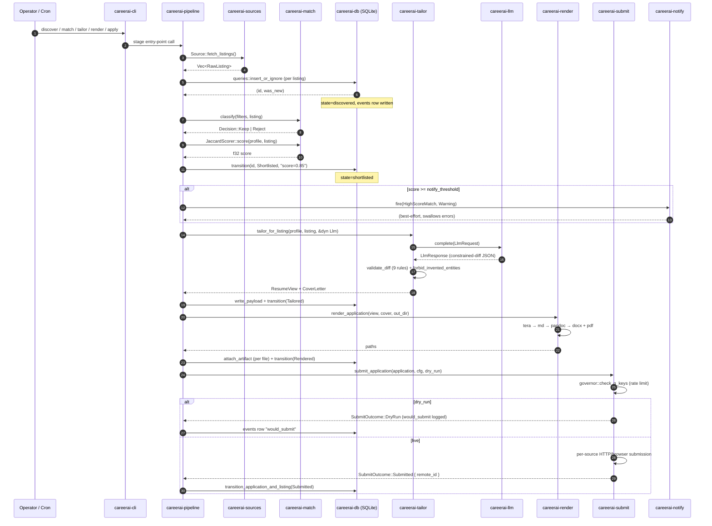

# Architecture

career-ai is a linear-state-machine pipeline orchestrated by either
the long-running daemon (`careerai daemon`) or one-shot CLI calls
(`careerai discover`, `careerai match`, `careerai tailor`, ...).
Both entry points compose the same stages through `careerai-pipeline`.

## Crate map

```
                     ┌────────────────────────┐
                     │  careerai-cli          │
                     │  (clap dispatch)       │
                     └────────┬───────────────┘
                              │
                     ┌────────▼───────────────┐    ┌─────────────────────┐
                     │  careerai-pipeline     │◄───┤  careerai-scheduler │
                     │  (only place stages    │    │  (cron daemon)      │
                     │   compose end-to-end)  │    └─────────────────────┘
                     └────────┬───────────────┘
                              │
        ┌──────────┬──────────┼──────────┬──────────┬───────────┬─────────┐
        ▼          ▼          ▼          ▼          ▼           ▼         ▼
┌──────────┐┌──────────┐┌──────────┐┌──────────┐┌──────────┐┌──────────┐┌────────┐
│ careerai-││ careerai-││ careerai-││ careerai-││ careerai-││ careerai-││careerai│
│ sources  ││ match    ││ tailor   ││ render   ││ submit   ││ profile  ││ -llm   │
│          ││          ││          ││          ││          ││          ││        │
│ Source   ││ filters+ ││constraind││ pandoc   ││Submitter ││  schema  ││Backend │
│ trait    ││  scorer  ││  diff    ││ subproc  ││  trait   ││ + ingest ││ trait  │
└────┬─────┘└────┬─────┘└────┬─────┘└────┬─────┘└────┬─────┘└────┬─────┘└────────┘
     │           │           │           │           │           │
     │           │           │           │           │           │
     └───────────┴───────────┴───────────┴───────────┴───────────┘
                              │
                     ┌────────▼───────────────┐
                     │   careerai-db          │
                     │   (sqlx + migrations)  │
                     └────────────────────────┘

      ┌────────────────────────┐    ┌─────────────────────┐
      │   careerai-dashboard   │    │   careerai-notify   │
      │   (axum, read-only)    │    │   (Slack/TG/email/  │
      │                        │    │    ntfy fan-out)    │
      └────────────────────────┘    └─────────────────────┘
                              │              │
                              ▼              ▼
                     ┌────────────────────────┐
                     │   careerai-core        │
                     │   (CoreConfig +        │
                     │    ListingState etc.)  │
                     └────────────────────────┘
```

`careerai-core` has no inbound deps (it's the foundation). Every
other crate imports from it. The `careerai-pipeline` crate is the
single place where stage adapters get composed end-to-end — neither
`careerai-cli` nor `careerai-scheduler` should reach past it into
the implementation crates.

## State machine

One row per listing transitions through:

```
discovered → filtered_out | shortlisted → tailored → rendered
           → prepared | drafted → submitted | skipped | failed
           → responded
```

Every transition writes an `events` row in the same transaction
that updates `listings.state`, so the audit log is always
consistent.

## One pipeline tick (sequence)



## Safety invariants by layer

| Layer | Invariant | Enforcement |
|---|---|---|
| Tailor | LLM may only reword/reorder existing bullets; cannot invent employers, years, numbers, or proper nouns absent from the profile | `careerai-tailor::guardrails::forbid_invented_entities` + 9 `validate_diff` rules. Tests assert every rule's negative path. |
| Submit | `auto_submit` defaults to false; dry-run never issues a network write | Per-source `submit_enabled` gate + `wiremock` integration tests asserting zero outbound writes in dry-run mode |
| Submit | Per-source rate caps + quiet-hours window | `governor` token-bucket + `RateLimiter::check_n_keys` at the boundary. New submitters MUST acquire a permit before any network call. |
| Submit | No secrets in logs | `tracing` redaction filter + regex-based test in `careerai-submit` asserting captured events contain no known-secret shapes |
| Dashboard | Loopback-only, read-only, no auth | `--bind` is hidden, non-loopback bind logs a loud no-auth warning; no mutation routes; no DB writes |
| Config files | Atomic write across platforms | `tempfile::NamedTempFile::persist` (Unix `rename(2)`, Windows `MoveFileExW(MOVEFILE_REPLACE_EXISTING)`) |

See [`SECURITY.md`](./SECURITY.md) for the full threat model and per-invariant test pointers.

## Notification fan-out

`careerai-notify` is best-effort: a broken webhook can never kill
the daemon tick. Channels run in `tokio::spawn` tasks; panics
surface as `JoinError::Panic` warn-logs.

```
HighScoreMatch / SourceUnreachable / CookieExpiringSoon /
ManualReviewNeeded / RateLimitExhausted / AuthFailureMidRun /
ApplicationResponded
                    │
                    ▼
       Pipeline::fire (drop if severity < min_severity)
                    │
       ┌────────────┼────────────┬────────────┐
       ▼            ▼            ▼            ▼
   Slack         Telegram      Email         ntfy
  (webhook)     (bot+chat)    (SMTP)       (topic push)
```

## Dashboard architecture

`careerai-dashboard` is a separate process from the daemon.
`careerai status serve` spawns an `axum` server on
`127.0.0.1:8787` that reads from the same SQLite the daemon
writes to.

```
       ┌─────────────────┐         ┌─────────────────┐
       │ careerai daemon │         │ careerai status │
       │ (cron driver)   │         │   serve         │
       └────────┬────────┘         └────────┬────────┘
                │ writes                    │ reads
                ▼                           ▼
       ┌──────────────────────────────────────────────┐
       │        SQLite ($CAREERAI_ROOT/data/...)      │
       └──────────────────────────────────────────────┘
```

The dashboard probes daemon health via `systemctl --user is-active
careerai` (1.5s timeout, 3-state output: active / inactive /
unknown). Both queries (DB snapshot + daemon health) run
concurrently per `tokio::join!`.
