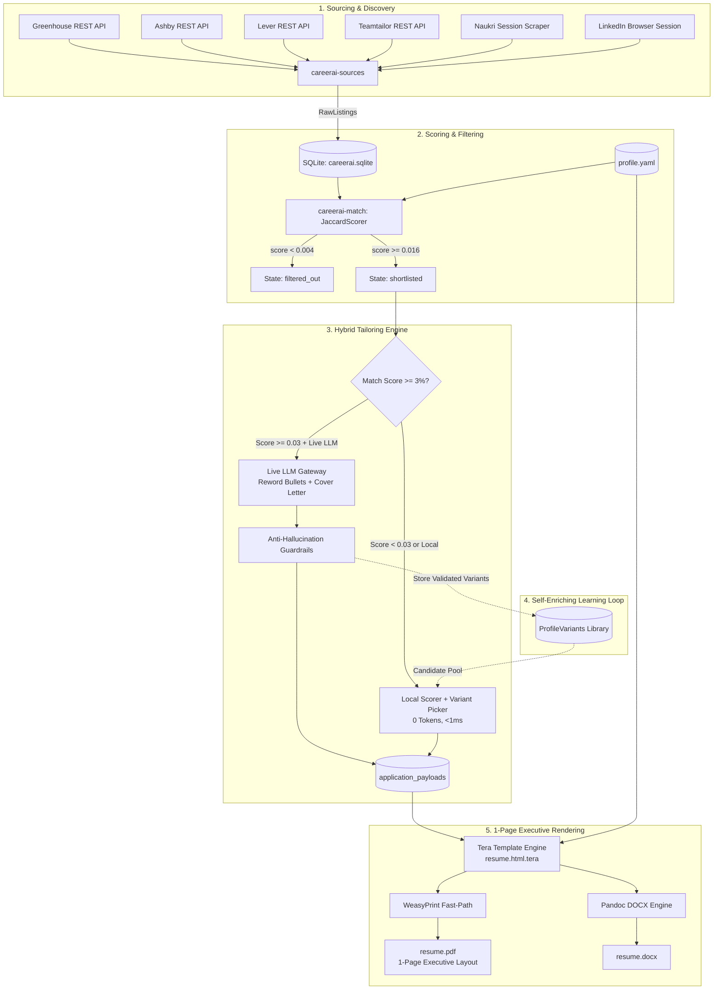
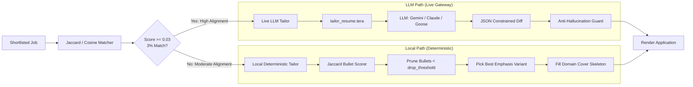
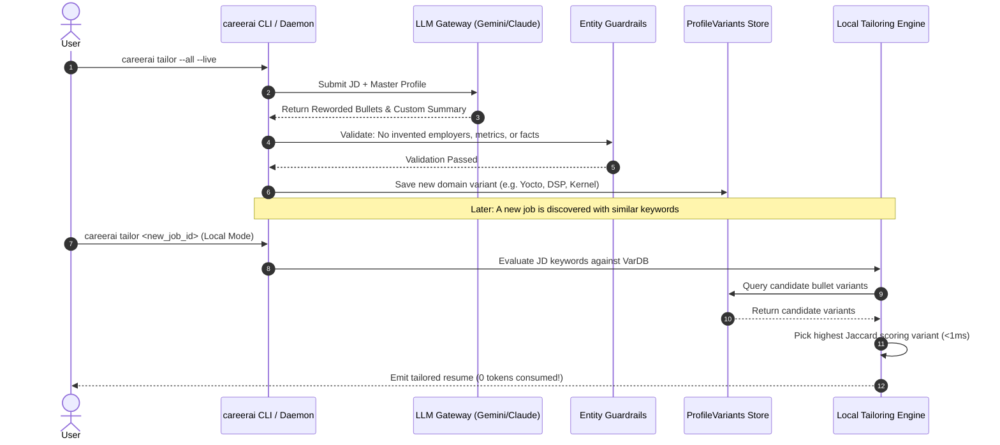
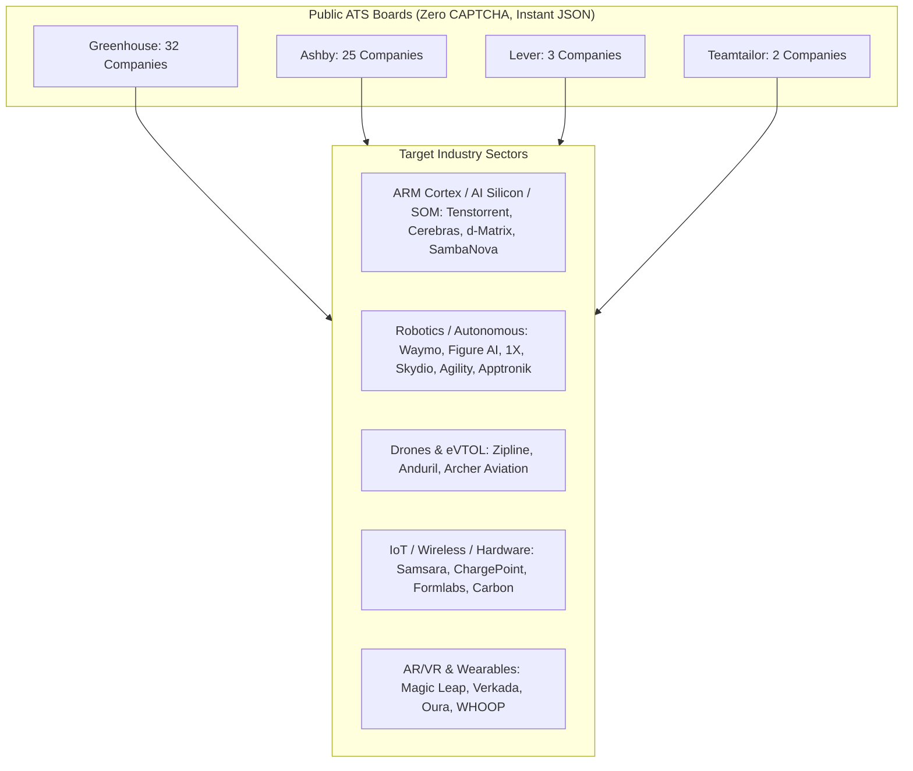

# CareerAI Architecture: Tailoring, Rendering & Learning Pipeline

This document provides a comprehensive technical reference for CareerAI's job discovery, hybrid tailoring, 1-page executive PDF rendering, and self-enriching bullet variant learning loops.

---

## 1. End-to-End System Architecture

CareerAI operates as an automated, event-driven career pipeline from public ATS discovery to 1-page application rendering and submission.



---

## 2. 1-Page Executive PDF Rendering Engine

### Visual & Geometric Layout

The resume rendering engine produces an exact, high-density, ATS-compliant 1-page document matching standard executive formatting.

```
┌────────────────────────────────────────────────────────────────────────┐
│  Kamal Kishor Pandey                      Gurugram, Haryana, India     │
│  Senior Embedded System Architect                   +91 7767984205     │
│                                           pandeykamal13526@gmail.com   │
│                                           in/kamalkishorpandey         │
│                                           justdoGIT                    │
├────────────────────────────────────────────────────────────────────────┤
│  PROFILE SUMMARY                                                       │
│  Senior Embedded Linux Engineer & System Lead with expertise in Yocto  │
│  BSP development, device drivers, secure boot, and OTA systems...      │
├────────────────────────────────────────────────────────────────────────┤
│  EXPERIENCE                                                            │
│  2025-01 –   Senior Embedded Developer (System Lead), SYMX.AI          │
│  Present     ○ Impact & Scale: Led Symbot6 deployment across fleets... │
│              ○ Qualcomm Depth: Optimized CPU/ADSP on QCM2290...        │
│              ○ OTA Strategy: Implemented OSTree-based atomic updates...│
│                                                                        │
│  2022-12 –   Senior Embedded Engineer, Vestel International            │
│  2024-07     ○ Root-of-Trust and signed Yocto Linux for EV chargers... │
│                                                                        │
│  2022-07 –   Senior Embedded Developer, Dozee                          │
│  2022-12     ○ Custom Linux BSP for NXP i.MX platform vibration...     │
│                                                                        │
│  2020-10 –   Senior Consultant, Capgemini                              │
│  2022-06     ○ V4L2 and GStreamer low-latency video streaming...       │
│                                                                        │
│  2017-07 –   Software Engineer, IFM Engineering Pvt. Ltd               │
│  2020-03     ○ Open-AMP/RPMSG IPC on Xilinx ZynqMP sensor sync...      │
├────────────────────────────────────────────────────────────────────────┤
│  TECHNICAL SKILLS                                                      │
│  Platforms     Qualcomm QCM2290, TI AM665x, NXP i.MX8, Xilinx ZynqMP   │
│  Core          Board Bring-up (U-Boot, Kernel, RootFS), Yocto BSP      │
│  OTA & Ops     OSTree, SOTA, Atomic Rollbacks, CI/CD (Jenkins, GitLab) │
│  Networking    CAN Bus (J1939), HaLow Wi-Fi, MQTT, WebRTC, TCP/IP      │
│  Debugging     JTAG, UART, Kernel Tracing (ftrace), Oscilloscopes      │
│  Languages     C, C++, Python, Bash, QT/QML, Rust                      │
├────────────────────────────────────────────────────────────────────────┤
│  EDUCATION                                                             │
│  2013–2017     B.E. Electronics & Telecommunications, AIT Pune         │
└────────────────────────────────────────────────────────────────────────┘
```

### Layout Specifications

| Layout Element | Specification | Rationale |
| :--- | :--- | :--- |
| **Page Geometry** | `size: A4; margin: 9mm 13mm 8mm 13mm;` | Maximizes usable area while ensuring printable margins on all printers. |
| **Page Budget** | Exactly **1 Page (`1/1`)** | Fits 5 multi-bullet experience entries, summary, skills table, and education. |
| **Header** | Two-column table (`60%` left / `40%` right) | Left aligns Name (`20pt`) & Title; Right aligns contact metadata. |
| **Section Dividers** | `border-top: 2.5px solid #000; padding-top: 1.5px;` | Sharp visual hierarchy matching executive engineering resumes. |
| **Experience Timeline** | Two-column table (`95px` date / `auto` content) | Scannable chronology for hiring managers and ATS parsers. |
| **Bullet Points** | `<strong>Label:</strong> Text` | Highlights key accomplishments (`Impact & Scale:`, `Qualcomm Depth:`). |
| **Skills Grid** | Two-column key-value table (`100px` category / `auto` items) | High-density grouping without horizontal clutter. |

---

## 3. Hybrid $\ge 3\%$ Threshold LLM Tailoring

CareerAI uses an intelligent tiered routing strategy to balance **deep customization** with **zero token waste**.



### Routing Rules

- **$\ge 3\%$ Match (`score >= 0.03`)**:
  - Automatically triggers the **Live LLM**.
  - Analyzes the complete Job Description text.
  - Rewrites bullet points (`"op": "reword"`) to align real project achievements with the job's target architecture, protocols, and tooling.
  - Generates a bespoke 3-paragraph cover letter targeted to the company.
- **$< 3\%$ Match (`score < 0.03`)**:
  - Uses the **Local Deterministic Tailor**.
  - Requires **0 tokens, 0 network calls, and executes in $< 1\text{ ms}$**.
  - Selects the best pre-computed bullet variants and domain cover letter template without risk of hallucination.

---

## 4. Self-Enriching Learning & Bullet Variant Loop

The system becomes progressively smarter over time by capturing LLM improvements into a local variant database.



### Anti-Hallucination Guardrails

To prevent LLMs from inventing fake experience, every LLM diff must satisfy strict invariant checks:

1. **Employer & Entity Invariance**: Employers, institutions, and date ranges cannot be modified or added.
2. **Metric Integrity**: Numbers, percentages, and scales must derive directly from the master profile.
3. **Length Constraint**: Rewritten bullets must stay $\le 280$ characters to maintain 1-page layout integrity.
4. **Coverage Invariant**: Every master bullet must have an explicit operation (`keep`, `reword`, `drop`, or `move_before`), with $\ge 1$ bullet preserved per experience entry.

---

## 5. Verified ATS Sources & Scraper Matrix

CareerAI queries public ATS endpoints directly via REST APIs without bot detection roadblocks:



### Verified Company Directory

| Category | ATS Platform | Verified Company Slugs |
| :--- | :--- | :--- |
| **Silicon / AI Chips / ARM** | Greenhouse / Ashby | `tenstorrent`, `sambanovasystems`, `cerebras`, `d-matrix`, `groq` |
| **Robotics & Humanoids** | Greenhouse / Ashby | `figureai`, `figure`, `1x`, `agilityrobotics`, `apptronik`, `formic`, `diligent` |
| **Autonomous Vehicles** | Greenhouse | `waymo`, `nuro`, `kodiak`, `outrider`, `maymobility`, `torcrobotics`, `locusrobotics` |
| **Drones & Aerospace** | Greenhouse / Ashby | `flyzipline`, `andurilindustries`, `skydio`, `archer` |
| **IoT, Wireless & Embedded** | Greenhouse | `samsara`, `chargepoint`, `formlabs`, `carbon`, `markforged`, `canonical` |
| **AR/VR & Wearables** | Greenhouse / Ashby | `magicleap`, `verkada`, `oura`, `whoop`, `osmo`, `smart-eye` |
| **Frontier AI Platforms** | Greenhouse / Ashby / Lever | `openai`, `anthropic`, `cohere`, `perplexity`, `mistral`, `togetherai`, `xai`, `scaleai` |

---

## 6. Execution Command Reference

```bash
# 1. Pull new listings from all 60+ verified company career boards
careerai discover

# 2. Score listings against profile.yaml
careerai match

# 3. Batch-tailor (>=3% match routed to Live LLM, <3% routed to Local Engine)
CAREERAI_LLM_LIVE=1 careerai tailor --all

# 4. Render all tailored applications to 1-page executive PDFs
careerai render --all

# 5. Start the web dashboard to inspect applications
careerai status serve --port 8787
```
