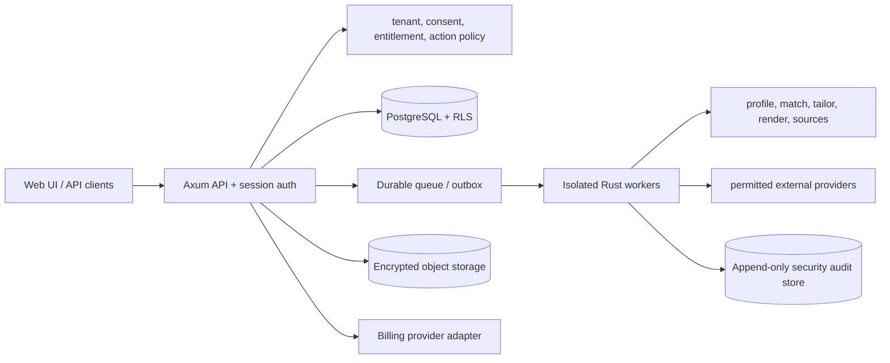
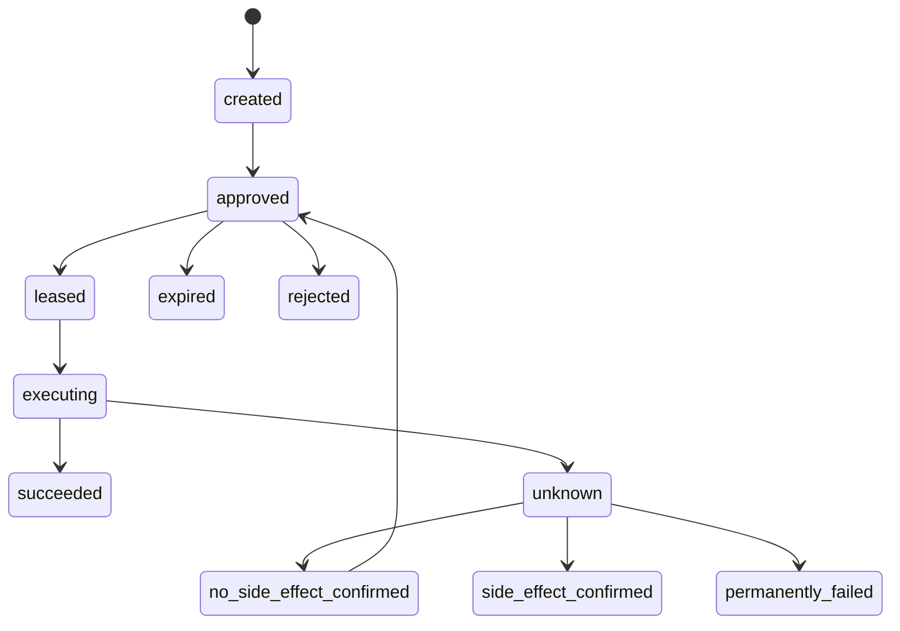

# CareerAI Career Operations Manager: Hosted Subscription Product

## Title & Metadata
- **Author:** [Author]
- **Date:** 2026-09-12
- **Status:** Draft
- **Audience:** Product, engineering, security, operations, finance, and legal reviewers

## Overview

CareerAI will evolve from a local, single-user Rust job pipeline into a consent-driven career operations manager. A candidate selects a target company, organization, role, or campaign and receives an evidence-based preparation program: opportunity discovery, explainable matching, truthful application materials, interview practice, recruiter discussion guidance, compensation questions, follow-up tracking, and eventually onboarding and employment administration. Bills, expenses, office trips, reimbursements, salary components, benefits, and tax-information cards are organizational aids, not professional advice.

The existing workspace supplies reusable domain logic but not a hosted trust boundary. It has 15 crates, SQLite, local files, OS keyring credentials, `pandoc` subprocesses, optional Chromium, and a loopback/read-only dashboard. The hosted product therefore starts as a new authenticated API and web surface around ports to existing pure logic, with PostgreSQL, encrypted object storage, a durable queue, isolated workers, provider-neutral entitlements, and explicit audit/security boundaries. Local mode remains supported and hosted synchronization is opt-in.



## Background & Motivation

The current `careerai-pipeline` composes `discover`, `match`, `tailor`, `render`, and `apply`; `careerai-sources` implements `Source`, `careerai-submit` implements `Submitter`, and `careerai-scheduler` drives cron work. `careerai-db` owns SQLite migrations and queries. `careerai-tailor` enforces constrained resume diffs and proper-noun guardrails. `careerai-notify` redacts secrets. The state machine (`discovered` through `responded`) records listing transitions in `events`.

This is a credible local product, not a hosted service. `careerai-dashboard` normally binds to loopback and is read-only/no-auth; Docker can expose it with an optional bearer token, but that is not a sufficient hosted security model. SQLite rows contain raw listing descriptions and JSON; rendered artifacts are filesystem paths; local logs, caches, profile files, and `~/.local/state/career-ai/logs` are not tenant-aware. Local assumptions also include `CAREERAI_ROOT`, `config/*.yaml`, `profile/profile.yaml`, OS keyring, `.env` fallback, SQLite transactions, `pandoc`, and browser cookies. These must be isolated behind hosted adapters.

## Goals & Non-Goals

### Goals

- Deliver a narrow, paid-beta-ready vertical slice before adding regulated or side-effect-heavy modules.
- Provide target-company preparation, honest applications, interview readiness, recruiter discussion checklists, benefits/compensation analysis, and manual outcome tracking.
- Preserve constrained diffs, dry-run defaults, source gates, rate limits, consent, auditability, and terms-of-service compliance.
- Add secure, classified documents; communications; expenses, bills, office trips, reimbursements, salary components, and sourced market intelligence incrementally.
- Provide multi-tenant authentication, authorization, billing, entitlements, usage controls, deletion/export, and observable operations.

### Non-Goals

No employment guarantee; professional tax/legal/accounting/investment advice; tax filing; bank/payroll/expense-card services; employer ATS; unrestricted scraping; CAPTCHA or stealth evasion; autonomous offer acceptance or negotiation; automatic recruiter messages in beta; hosted browser automation in beta; or global tax support. LinkedIn, Indeed, Naukri, mailbox, recordings, financial/tax calculations, and market aggregation are post-beta gated capabilities.

## Product Scope and Hosted Beta

### Narrow vertical slice

The hosted beta serves invited individual candidates in one niche (AI/ML, embedded, or robotics) and one region (India, remote-first/Delhi-NCR), with one personal workspace per account. It contains only:

1. Account and workspace creation, profile import/confirmation, target role/company selection.
2. Permitted ATS/feed discovery from a reviewed allowlist; explainable matching and freshness.
3. A target-company preparation program: sourced company/role dossier, fit map, evidence-linked STAR stories, interview questions, recruiter questions, benefits/compensation checklist, and due dates.
4. Review-only tailored resume/cover-letter artifacts using the existing constrained-diff logic; preview and download, never live submission.
5. Manual application, interview, email/call outcome records and follow-up reminders.
6. Versioned encrypted export, user deletion request, and deletion-status display.
7. Free/paid entitlement admission and usage visibility, with no browser minutes or expensive work admitted without an entitlement reservation.

Beta explicitly excludes live submission, all browser automation, mailbox OAuth/sync, call recording, document vault beyond generated artifacts, tax cards/calculations, reimbursement processing, market-news aggregation, coach/concierge access, and automatic communication.

### Beta exit criteria and ownership

The beta owner is the Product/Engineering lead; Security owns threat-model gates; Operations owns SLOs/backups; Legal/Privacy owns regional and vendor approval. Exit requires all of the following, measured over 30 days and at least 20 invited users: 60% onboarding completion, median time to first reviewed match under 10 minutes, 40% week-two return, 30% of active users complete a preparation program, >=80% of generated claims have evidence or an explicit unresolved label, zero cross-tenant test failures, zero live external writes, 99.5% API availability, p95 API latency under 500 ms excluding queued work, RPO <=15 minutes and RTO <=4 hours demonstrated by restore drill, and gross contribution margin model completed with actual provider/support costs. A written security review, privacy notice/DPA, subprocessor inventory, source-permission register, incident runbook, and deletion/export drill are release gates. If any gate fails, remain invite-only or rollback the relevant feature flag.

### Later milestones and exit criteria

- **M2 documents:** after key hierarchy, malware quarantine, lifecycle, and deletion verification tests; >=99% upload scan completion and successful restore/delete drill.
- **M3 communications:** after legal approval of exact OAuth scopes, token handling, retention, and send policy; 100% outbound sends require reviewed approvals in tests.
- **M4 financial administration:** user-entered compensation, bills, expenses, trips, reimbursements, and exports only; no calculations. Exit requires correction history, journal balancing, and export reconciliation.
- **M5 regional information:** only one named tax year/population and reviewed rule pack; stale/withdrawn rules fail closed. Legal and named rules-owner sign-off required.
- **M6 controlled side effects:** per-source written permission/terms decision, consent expiry, adapter contract tests, crash/reconciliation tests, and live-action kill switch. Browser automation remains off unless separately approved.

## Proposed Design

### Bounded contexts and repository mapping

| Hosted context | Existing source of logic | Reuse vs rewrite |
|---|---|---|
| Pipeline orchestration | `careerai-pipeline/src/{discover,match_,tailor,render,apply,followups}.rs` | Reuse pure stage policies; rewrite I/O as service ports and durable commands |
| Foundation/config/state | `careerai-core/src/{config.rs,paths.rs,state.rs,salary.rs}` | Reuse typed state/salary concepts; hosted config and tenant policy are new |
| Persistence | `careerai-db/src`, `migrations/0001`–`0013` | SQLite remains local; hosted PostgreSQL repositories/migrations are new |
| Profile | `careerai-profile/src/{schema,docx,pdf,linkedin,merge}.rs` | Reuse parsers/validation in isolated workers; no local paths |
| Sources | `careerai-sources/src` | Reuse only reviewed permitted adapters behind source ports |
| Matching | `careerai-match/src` | Reuse scoring, eligibility, skill-gap logic as pure code |
| LLM | `careerai-llm/src/{backend,cache,rig,retry,cost}.rs` | Reuse provider abstraction; hosted budgets, retention and prompt data policy are new |
| Tailoring | `careerai-tailor/src` | Reuse constrained diff and evidence guardrails |
| Rendering | `careerai-render/src` | Worker-only `pandoc`; sandbox, resource limits, artifact object storage |
| Submission | `careerai-submit/src` | Local safety reference; no hosted live submit in beta |
| Scheduling/notifications | `careerai-scheduler`, `careerai-notify` | New durable jobs and hosted notification adapters |
| Interfaces | `careerai-cli`, `careerai-mcp`, `careerai-dashboard` | Local CLI/MCP/dashboard stay local; hosted API/UI are new |

### Preparation program

`PreparationProgram` is keyed by tenant, target company, role/listing, target date, and profile revision. In beta, its dossier inputs are limited to the selected listing's stored title, description, requirements, source URL, freshness timestamp, and provenance, plus a manually curated company record maintained by the product team (`company_id`, approved facts, citations, `curated_at`, `reviewed_at`, `expires_at`, and status). No general web research, news aggregation, or uncited model knowledge is a beta input. If the listing is empty/stale or the curated record is missing/expired, the program visibly reports the unavailable section and creates a manual-review task; it does not fill gaps from web search. Tasks contain evidence links, provenance, expected effort, due date, AI/user author, confidence, and state. It generates a fit map, constrained application plan, technical/behavioral questions, STAR mappings, mock-practice prompts, recruiter questions, benefits checklist, salary-component discussion, negotiation language, follow-up plan, and a transparent checklist readiness score. It never presents readiness as hiring probability and never invents candidate facts.

### Canonical action and approval protocol

Every external side effect has one immutable `external_actions` record. The record contains `action_id`, tenant/actor, action type, adapter and provider scope, canonical UTF-8 JSON payload, `payload_schema_version`, SHA-256 payload digest, immutable artifact IDs/checksums, recipient/account identifiers, consent IDs and versions, source-terms version, policy snapshot, entitlement reservation, idempotency key, approval actor/time/expiry, and state:

`created -> approved -> leased -> executing -> succeeded | rejected | unknown`; `unknown -> no_side_effect_confirmed -> approved` (fresh approval required) or `unknown -> side_effect_confirmed | permanently_failed`; `approved -> expired`; `reconciled` is an evidence record only and never executable. `unknown` consumes the current lease and marks the current entitlement reservation as held-for-reconciliation; it cannot execute or be leased.

Canonical JSON uses sorted object keys, normalized Unicode, explicit null handling, and decimal strings; artifact bytes are hashed. Approval is one-time, exact-payload, expires in 10 minutes, is revocable before lease, requires recent reauthentication for sends/submissions/exports, and is invalidated by consent, terms, policy, or entitlement changes. The API atomically creates the action, reserves usage, and writes an outbox entry. Before any provider call, the worker durably commits `executing` with a fencing token and attempt ID. Every crash, timeout, lost heartbeat, or lease expiry from `executing` becomes `unknown`; it may return to an executable state only after an adapter-specific reconciliation proves that no side effect occurred. Missing markers or a worker heartbeat never prove that a call did not begin.

Adapters must use provider idempotency where supported. Where unsupported, they implement source-specific preflight/receipt lookup and duplicate detection; unknown outcomes enter reconciliation with a provider-specific timeout (default 15 minutes, maximum 24 hours) and then a manual-review queue. If reconciliation proves no side effect, emit `no_side_effect_confirmed`, release the held reservation, and require a new exact-payload approval (or preserve the old approval only if it remains unexpired and the policy version explicitly permits preservation); any retry creates a new lease and audit event. If reconciliation proves a side effect, emit `side_effect_confirmed`, finalize/rebill usage from the provider receipt, and make no retry. If evidence remains unavailable, emit `permanently_failed` only through manual review, release or charge the reservation according to provider-cost evidence, and preserve the unknown record. The UI displays “provider outcome unresolved,” disables retry from `unknown`/`reconciled`, shows evidence and expiry, and offers only reconciliation or a new approval flow. Manual review cannot silently retry. Crash tests kill the worker immediately before and immediately after each network write and assert `unknown` with no blind retry, as well as after receipt persistence and during duplicate delivery. Provider webhooks/receipts are stored with provider event ID, signature verification result, and reconciliation state. No internal idempotency key is described as a guarantee when a provider lacks idempotency.



### Audit integrity and verification

Use a dedicated append-only database role for `security_audit_events`; application roles cannot insert arbitrary event bodies, and neither application roles nor the migrator can update/delete historical rows. Every authoritative state-change transaction calls a trusted audit-ingestion/outbox boundary owned by the domain service. The boundary accepts only a typed event kind, actor/service context, transaction ID, and source-record identifiers; it loads the authoritative source rows under RLS, derives the canonical event body, and stores source-record hashes for the action, approval, entitlement reservation, support grant, or state transition. The transaction commits the authoritative change and its audit outbox/ledger entry atomically. A dispatcher may only deliver an already-committed typed entry; it cannot invent, edit, or omit an event. Missing audit output is an alertable reconciliation failure, not a valid state.

Use one global sequence allocated by a database sequence plus a per-partition sequence for each tenant-independent audit shard. A transaction locks the shard head, assigns the next global/shard sequence, and records `previous_hash`; concurrent writers serialize at the shard head. A fork, duplicate sequence, gap, conflicting previous hash, or partition merge mismatch is rejected and pages Security. Events use `event_hash = SHA-256(domain || shard_id || sequence || previous_hash || canonical_event)` and include schema version, actor/service, transaction/request/job IDs, source-record hashes, and authoritative table/version identifiers. Reconciliation continuously compares required event kinds against committed domain transitions, approvals, reservations, grants, and outbox entries.

A signer controlled by Security—not application operators—anchors every 5 minutes and whenever 10,000 events accumulate, with a hard maximum unanchored window of 15 minutes. An anchor contains global/shard sequence ranges, first/last hashes, segment Merkle root, schema version, and key ID, and is written with retention lock to immutable/WORM object storage. If anchoring misses the 15-minute deadline, audit-dependent approvals and exports pause. The signing key is owned in the organization KMS/HSM, access is dual-controlled, rotated annually and immediately on compromise; compromise revokes the key, freezes new anchors/actions, preserves old verification keys and anchors, issues a new key epoch, and triggers incident review.

`careerai-audit-verify` downloads anchors and segments, validates signatures, sequence continuity, hash links, domain separation, source-record hashes against a read-only database snapshot, and no duplicate/replayed events; it emits a report without modifying data. Restore imports into quarantine, verifies against the latest anchor, reconciles source records/outbox entries, and only then promotes. A segment rollback, anchor gap, fabricated event, missing event, or fork leaves audit-dependent actions disabled. Corrections are new typed `correction` events referencing the original hash and reason; originals are never edited. Operators have no row-write access; break-glass reads require dual approval and are logged in a separate chain. Retain segments/anchors for seven years or the applicable legal minimum; deletion keeps only a minimal pseudonymous deletion receipt containing subject/workspace hash, request ID, time, policy version, source-record hashes, and terminal audit hash. Tests cover fabricated direct inserts, missing event/outbox rows, concurrent writers, forked chains, duplicate/replay, lost latest unanchored segments, mutation, deletion, rollback, key compromise, restore, and correction verification.

### Object-storage authorization

Object bytes are never authorized by an object key alone. Every request first loads the tenant-scoped database object-version row through RLS and checks purpose, user/action, classification, lifecycle state, and revocation. The API then issues a capability bound to `{tenant_id, object_version_id, user_id, action_id or purpose, HTTP method, permitted byte range, issued_at, expires_at, capability_version}` and signs it with a server-held capability key. Proxy all C1 content when immediate revocation is required and all C2–C4 content; use storage-native signed URLs only for low-risk C0/C1 downloads after the same DB check. Native URLs have a five-minute maximum TTL and revocation is explicitly bounded by that TTL: a later DB revocation cannot invalidate an already-issued URL. Native URLs are prohibited for deleted, legal-hold, incident-response, or otherwise immediate-revocation objects. Proxy capabilities expire in five minutes and are checked on every request, providing immediate revocation.

Keys use generated opaque prefixes (`tenant UUID/object UUID/version UUID`), never user filenames or path traversal characters; filenames are metadata only. Proxy requests reject ranges not covered by the capability, do not honor cache authorization headers, and return `Cache-Control: no-store` for C1–C4. Native URL responses may be prefetched/replayed/concurrently downloaded only within their five-minute TTL and low-risk class; deletion blocks new issuance immediately but an already-issued native URL may continue until TTL, while proxy deletion revokes in-flight authorization at the next chunk boundary. Upload completion, copy, delete, and download paths enforce capability claims. A daily orphan scanner compares object inventory to live DB versions, quarantines unexpected objects, and deletes them after investigation. Tests cover cross-tenant access, revoked proxy capabilities, bounded native-URL revocation, replay/expiry, range mismatch, prefetch, concurrent deletion, version confusion, forged keys, object substitution, and orphan detection.

### Tenant isolation and database context

Choose PostgreSQL Row-Level Security (RLS), not an either/or repository promise. Application roles: `careerai_api` (no bypass RLS), `careerai_worker` (no bypass RLS), `careerai_webhook` (no bypass RLS), `careerai_migrator` (DDL only, separate deployment), and a break-glass `careerai_support` role that cannot access customer rows without an audited, time-limited support grant. Each customer table has `tenant_id`; foreign keys use composite `(tenant_id, id)` references so cross-tenant references cannot exist.

Every transaction begins by authenticating an internal signed context and executing `SET LOCAL app.tenant_id`, `app.actor_id`, `app.job_id`, and `app.access_reason`; absent or malformed context causes a hard failure. Pool checkout resets/discards the connection; context is never set globally. Workers receive tenant/job context from a signed queue envelope, re-resolve membership and entitlement in a transaction, and cannot accept tenant IDs from untrusted payloads. Webhook handlers resolve provider event to the stored tenant mapping, then set context; unknown mappings are quarantined. Reports/export jobs use one tenant per transaction. Migrations run outside customer sessions.

Tests attempt another tenant's IDs through every API route, worker job, webhook, export, reporting, support, and object-storage path; test missing context, connection reuse leakage, forged queue envelopes, forged webhook mappings, composite-FK violations, and support grant expiry. Expected result is uniform `404` for inaccessible resource reads (no enumeration) and `403` for authenticated policy denial.

### Entitlements and billing admission (before metered jobs)

Before any costly job exists, define a provider-neutral `EntitlementDecision` and usage ledger. A job admission transaction locks the entitlement version, reserves estimated units, writes `usage_reservations`, and enqueues only after commit. Workers finalize actual units or release the remainder; reservations expire safely. Admission fails closed except for explicitly free/read/export operations. Entitlements include plan ID/version, feature, limits, period, region, and status.

Billing stores provider-neutral price versions, currency, tax-inclusive display flag, trial dates, proration policy, refund/chargeback state, and provider IDs. Webhooks are signature-verified, persisted before processing, deduplicated by `(provider,event_id)`, and applied by event version/time rules; out-of-order events trigger reconciliation. Upgrade takes effect after verified payment; downgrade at period end; failed payment retains read/export/delete access but blocks new metered work after a documented grace period. A merchant-of-record or CareerAI responsibility for GST/VAT, invoices, refunds, disputes, and support is a launch decision requiring written provider/legal confirmation—not assumed from a vendor name.

### Support access controls

Support is default-deny by data class. A support grant requires a ticket ID, reason code, named support actor, customer consent, and explicit resource IDs; an incident exception requires Security incident ID and dual approval. The matrix is:

| Class | Metadata | Content read | Download | Mutation/approval |
|---|---|---|---|---|
| C0 | scoped yes | scoped yes | no by default | no |
| C1 | scoped yes | no by default; consent + redacted view only | never | no |
| C2 | minimal metadata only | denied | denied | never |
| C3 | existence/health only | denied | denied | never |
| C4 | existence/retention only | denied | denied | never |

Support grants are resource-scoped, read-only, max 30 minutes, automatically revoked, session-recorded where technically possible, fully audit-chained, and notify the customer at grant and closure. Support cannot bulk query, export, switch tenants, create approvals, issue capabilities/signed URLs, impersonate, or access secrets. Monthly review checks ticket/reason, scope, timestamps, and notification; violations revoke the role. Tests prove C2+ denial, no cross-tenant reads, no bulk/export/approval/capability paths, expiry, revocation, notification, and incident-exception dual control.

### Document, token, and communication lifecycle

| Class | Examples | Default processing | Retention/deletion |
|---|---|---|---|
| C0 public | listing text, public news | provider worker allowed | source/license policy |
| C1 personal | profile, resume, interview answers | encrypted hosted processing with consent | active account + user policy |
| C2 sensitive | ID/onboarding, offer, receipts, compensation | server-readable only when feature enabled; no default LLM | user-controlled; strict access |
| C3 secret | OAuth refresh token, cookies, provider keys | secrets vault only; never logs/LLM/export | revoke then cryptographic destruction |
| C4 restricted | recordings, support export, legal hold | disabled by default; explicit regional consent | shortest justified period/legal hold |

Use KMS/HSM-backed envelope encryption: a regional KMS root key wraps per-tenant data-encryption keys; per-object DEKs encrypt files with AEAD and authenticated metadata; a separate secrets key encrypts OAuth tokens. Rotate wrapping keys annually and on incident; rewrap DEKs without rewriting bytes; destroy tenant key material after retention/legal-hold release, subject to documented backup expiry. Object ACLs are private; signed URLs are one-use/short-lived and scope-bound. Uploads enter quarantine, verify magic bytes/declared type, scan malware, optionally disarm active content, and become available only after a clean result. Rendering/LLM workers receive least-privilege, time-limited access and wipe scratch space.

Exports are encrypted to a user-provided passphrase/public key and include a manifest. Deletion marks a workflow, revokes sessions/tokens, removes primary rows/objects, invalidates caches and signed URLs, deletes worker scratch, and records completion. Backups expire within 35 days; deletion is complete when primary/replicas, object versions, search indexes, caches, and eligible backup generations have passed their purge window. Immutable security audit records retain only minimum pseudonymous metadata and deletion receipt, not content. Legal holds suspend deletion and are visible to the user.

Beta has no mailbox OAuth or call recordings. Later mailbox access is read-only, exact provider scopes documented per provider, incremental cursor/webhook ingestion, no broad attachment download by default, token vault storage, revoke/disconnect, provider-deletion limitations, and user-selected excerpts only. Recording is disabled unless jurisdictional consent is confirmed for all participants.

### Financial, tax, and benefits boundary

MVP has no tax calculation or tax-saving recommendation. M4 permits user-entered salary components (base, bonus, equity, sign-on, benefits, severance), bills, expenses, office trips, reimbursements, perk discovery, and accountant-ready CSV/JSON exports with correction history and source attachments. It does not determine deductibility or submit claims.

A future M5 tax card is limited to one named jurisdiction, tax year, residency/employment population, currency, and approved categories. Each versioned rule pack contains rule ID, source hierarchy/URLs, effective and withdrawal dates, assumptions, test fixtures, calculation version, reviewer and approval date. Conflicts or stale rules fail closed to “consult a licensed professional”; a hard kill switch disables the pack. Every output says informational only and shows inputs, assumptions, provenance, confidence, and last review. Legal/privacy counsel and a named rules owner must sign a launch checklist; external tax correctness and regulatory treatment are unverified dependencies.

### API / Interface Changes

Hosted `/v1` uses problem+json, uniform inaccessible-resource behavior, idempotency headers, signed session cookies, and reauthentication for sensitive commands:

```text
POST /v1/auth/start                 POST /v1/auth/callback
POST /v1/auth/logout                POST /v1/auth/recover
GET  /v1/workspaces                 POST /v1/workspaces/{id}/switch
POST /v1/profiles/imports           POST /v1/preparation-programs
GET  /v1/listings                   POST /v1/applications/{id}/preview
POST /v1/applications/{id}/approvals POST /v1/applications/{id}/actions
POST /v1/exports                    DELETE /v1/account
POST /v1/billing/checkout           POST /v1/billing/webhooks/{provider}
```

### Authentication and authorization

Initial path: email magic-link login with verified email plus mandatory TOTP MFA before beta data access; passkeys may be added later. Each magic link is a single-use, 10-minute hashed token bound to a login transaction, browser/device risk context, and requested workspace where practical; a changed context requires restarting login. Links are never accepted twice, concurrent transactions are invalidated on completion, and the UI warns against forwarding. Notify the account through the verified email channel on login, recovery, MFA enrollment/reset, session revocation, export, and deletion requests. Recovery codes are shown once, hashed at rest, have a generated set ID, and regeneration atomically invalidates the prior set.

Recovery requires verified email plus an unused recovery code; losing both email and TOTP requires support-assisted recovery with dual-control Security approval, identity evidence, all sessions revoked, MFA reset, and a documented ticket. A recovered account enters a 24-hour cooldown before export, account deletion, capability issuance, or any future side-effect approval. Sessions are opaque, hashed server-side, Secure/HttpOnly/SameSite cookies, CSRF-protected, rotated after login and privilege change, idle timeout 30 minutes and absolute timeout 30 days. No bearer tokens in browser storage. Login, recovery, invite, and import endpoints are abuse-rate-limited. Tests cover forwarded/replayed links, concurrent transactions, risk-context mismatch, TOTP reset, recovery-code rotation, notifications, session revocation, dual-control recovery, and recovery followed by export/delete.

A personal workspace is created at first verified login; one account may later join multiple workspaces and must explicitly switch context. Beta roles are `owner` and `support_readonly`; no member/coach role is exposed until delegation is designed.

| Resource/action | Owner | Support readonly |
|---|---|---|
| Read/write own profile, programs, listings, outcomes | yes | no by default |
| Generate/preview artifacts | yes | no |
| Export/delete/account closure | yes + reauth | no |
| Approve/send/submit side effect | yes + reauth + consent | never |
| Billing/plan/change payment | yes | no |
| Security/audit timeline | own customer view | limited internal view with grant |
| Support diagnosis | no implicit access | time-limited, reason-coded, redacted grant |

All resource queries are tenant-scoped. Authorization failures do not reveal whether another tenant's ID exists. Support cannot impersonate or create approvals; emergency access is dual-approved, time-limited, read-only where possible, and audited.

### Local-to-hosted import/export

Format `careerai-export/v1` is a ZIP containing canonical UTF-8 JSON manifest, profile YAML snapshot, normalized records, event history, artifact bytes, SHA-256 checksums, source provenance, local-config non-secret subset, and export timestamp. It explicitly excludes keyring credentials, cookies, `.env`, raw API keys, and local cache by default. The manifest has schema version, exporter version, local tenant ID, record counts, and Merkle root. Export is encrypted and reauthentication-protected.

Import is an idempotent job with states `received -> verified -> planned -> importing -> verifying -> completed | partial | rolled_back`. Records map by `(local_tenant_id, entity_type, local_id)`; duplicate identities use checksum/equivalence then create a conflict requiring user choice. Artifact bytes are verified before commit. Each batch has a transaction and checkpoint; resume is safe, partial failures are visible, and rollback removes only the import's mapping. Credentials are re-established through new OAuth/key entry, never imported by reference.

### Canonicalization and shared test vectors

All action, export-manifest, audit-event, and Merkle inputs use the named `careerai-c14n/v1` profile. It encodes JSON objects with UTF-8, Unicode NFC normalization applied to every string, JSON escaping with lowercase hexadecimal `\\u00xx` escapes only where JSON requires escaping, and no insignificant whitespace. Object keys are NFC-normalized and sorted by UTF-8 byte sequence; duplicate keys are rejected before normalization. Allowed scalars are `null`, `true`, `false`, and strings; numbers are forbidden in canonical payloads and represented as decimal strings matching `^-?(0|[1-9][0-9]*)(\\.[0-9]+)?$`, with no exponent, leading plus, or trailing fractional zero normalization beyond the supplied schema rule. Arrays preserve schema-defined order; unordered arrays are sorted by their schema-declared stable key before encoding. The schema name/version is the first domain-separated field, so schema changes cannot reuse a digest.

Merkle leaves use `SHA-256("careerai-merkle-leaf/v1\\0" || UTF8(entity_type) || "\\0" || UTF8(entity_id) || "\\0" || raw_canonical_bytes)`, sorted by `(entity_type UTF-8 bytes, entity_id UTF-8 bytes)`, and parent nodes use `SHA-256("careerai-merkle-node/v1\\0" || left || right)` with the last node duplicated at odd levels. Shared vectors include input JSON, normalized output, payload digest, leaf bytes/digest, sorted order, and root for local Rust and hosted implementations; CI runs both implementations against the same fixture file.

## Observability and Operations

The service owner is Engineering; Security owns security incidents; Operations owns on-call, backups, and providers; Product owns beta gates; Legal/Privacy owns regulatory/vendor approvals. Primary SLOs are 99.5% beta API availability, p95 synchronous API latency <500 ms, 99% queued jobs started within 5 minutes, and 99.9% successful export jobs. RPO is 15 minutes and RTO 4 hours for beta, demonstrated monthly; backups are encrypted, daily full/continuous WAL as supported, retained 35 days, and restore-tested monthly.

Queue delivery is at-least-once with leases, fencing, exponential backoff (maximum 5 attempts), dead-letter after poison-job classification, and manual replay only after policy revalidation. Provider outages stop affected adapters, preserve drafts, and never downgrade an approved action into an unapproved retry. Deployments use expand/contract migrations, canary tenants, feature flags, and rollback images; irreversible migrations have forward repair plans and restore checkpoints.

Metrics use an explicit event envelope: `{schema_version, event_name, occurred_at, tenant_metric_key, actor_type, consent_scope, source, object_type, object_id_hash, properties, sample_rate}`. `tenant_metric_key` is a rotating pseudonym stored separately from product data; raw tenant IDs are omitted from general logs. Event names include `onboarding_completed`, `match_reviewed`, `program_completed`, `artifact_previewed`, `outcome_recorded`, `action_approved`, `action_denied`, `usage_reserved`, `usage_finalized`, `subscription_changed`, and `export_completed`. Communication/outcome metrics are collected only after separate opt-in; users can disable analytics and export/delete telemetry. Rates require defined denominators, a 30-day window, and minimum n=20; tiny samples are suppressed.

Pager alerts cover cross-tenant test failures, missing context, unusual downloads, approval bypass, duplicate side effects, queue backlog, backup failure, RPO breach, stale rules, provider terms changes, webhook drift, cost spikes, and suspected incidents. Incident response: page owner, contain (pause queue/revoke keys/force dry-run), preserve forensic evidence, assess affected tenants, notify security/legal, notify customers within the applicable contractual/legal window, remediate, and publish a postmortem. Support access is reviewed monthly; logs are redacted, access-controlled, retained 30 days unless incident-held, and never contain content, tokens, cookies, or credentials.

## Integrations and External Dependencies

The beta allowlist is limited to ATS/feed adapters with documented permitted use and contract fixtures. Community scrapers, undocumented endpoints, LinkedIn/Indeed/Naukri browser automation, Gmail/Outlook, calendar, Stripe/MoR behavior, model retention, cloud KMS/object-store guarantees, and jurisdictional tax/privacy conclusions are **unverified pending vendor/legal review**. Each candidate integration requires a signed terms/DPA or documented provider guarantee, scopes, data retention/deletion limits, rate limits, incident contact, cost model, and source-terms version before a paid SLA or feature flag. Hosted browser automation is disabled in beta; prohibited behavior includes CAPTCHA bypass, stealth evasion, unsupported endpoints, credential sharing, and action after consent/terms expiry.

## Pricing, Unit Economics, Concierge, and Growth

Use configurable regional price versions, not hardcoded prices: Free (profile/manual tracking), Pro (scheduled permitted discovery, preparation, artifacts, interview practice, journals), and Concierge (only after a separate handling review). Indicative $15–25/month Pro and $49–79/month Concierge are hypotheses, not commitments. Annual plans and coach licensing are later tests. Revenue must not come from candidate data sales or undisclosed ranking/referrals.

Unit economics uses monthly active subscribers: revenue less payment/MoR fees, LLM tokens, document/object storage, queue/compute, browser (if ever approved), email, support labor, compliance/legal allocation, refunds/chargebacks, taxes, and acquisition cost. Track gross margin and contribution margin per plan, with a target >70% gross margin only after all listed costs are measured. Concierge access is off in beta; if enabled, reviewers must be employees or explicitly approved confidential-data subprocessors, use least-privilege time-limited grants, MFA, confidentiality terms, no downloads by default, audited access, defined retention, and customer disclosure/opt-out.

Acquire users through a 10–15-person niche pilot, synthetic-data demos, technical communities, career coaches, newsletters, transparent referral credits, and privacy-first content. Marketing must not promise interviews, tax savings, or autonomous success. The realistic recurring-income path is retained workflow value, annual renewals, paid setup/concierge, coach licensing, and disclosed partner referrals; it still requires ongoing source maintenance, support, compliance, and cost control.

## Security & Privacy Considerations

Launch gates are threat modeling, dependency/SAST/secret scans, RLS/adversarial tests, auth/session tests, action crash tests, malware tests, export/delete/restore drills, access review, incident exercise, and legal/privacy approval. Preserve local constrained-diff, redaction, rate-limit, dry-run, per-source gate, and prompt-injection mitigations. Hosted model processing is opt-in by data class and provider retention policy. Data minimization, consent receipts, purpose limitation, subject export/deletion, DPA/subprocessor inventory, and regional residency decisions precede paid launch.

## Rollout Plan

1. Local compatibility and design gates; no hosted customer data.
2. Internal hosted environment with synthetic data; verify auth, RLS, worker context, billing admission, import/export, backup/restore.
3. Invite-only beta vertical slice; all external writes disabled, one region/source allowlist, free and test billing.
4. Paid beta after exit criteria, legal/vendor checklist, support/on-call readiness, and cost model.
5. Post-beta modules behind independent flags and exit criteria; controlled side effects last.

Rollback disables the feature/region/source flag, pauses workers, revokes credentials, forces dry-run, and preserves audit/export. Data migrations are expand/contract; restore is the last-resort recovery path.

## Alternatives Considered

1. Publicly expose the current no-auth SQLite dashboard: rejected for isolation, auth, concurrency, and backup risk.
2. Immediate microservices rewrite: rejected before product validation; modular monolith plus isolated workers is operable.
3. Hosted-only rewrite: rejected because local privacy/offline value and migration safety matter.
4. Fully autonomous applications/outreach: rejected for consent, duplication, reputation, and terms risk.
5. Global tax engine in MVP: rejected; user-entered financial records/export precede one reviewed regional information pack.

## Open Questions

1. Which initial merchant-of-record/provider and contractually verified tax/refund/support responsibilities will be used?
2. Which ATS/feed sources have written paid-use permission for beta?
3. Which India population, tax year, and rules owner—if any—will approve M5?
4. Which model providers' retention/DPA terms permit each data class?
5. Is support access employee-only, or will an approved subprocessor be needed?
6. What data residency and customer-notification commitments can Operations fund?
7. When, if ever, will a source-specific live action or browser automation be legally approved?

## Key Decisions

- **Narrow vertical slice first:** beta proves trusted discovery, preparation, review-only artifacts, and manual outcomes before regulated or side-effect features.
- **Email magic link plus mandatory TOTP initially:** concrete, supportable authentication; passkeys/OIDC are later extensions.
- **PostgreSQL RLS with fail-closed transaction context:** database-enforced tenant isolation covers API, workers, webhooks, exports, and support.
- **Provider-neutral entitlement admission before metered work:** reservations and finalization prevent unbilled expensive jobs and fail closed.
- **Immutable canonical action records with leases and reconciliation:** approval is tied to exact content and unknown provider results are never blindly retried.
- **Conservative executing recovery:** every crash or lease expiry after durable `executing` becomes `unknown` unless adapter evidence proves no side effect.
- **Hash-chained, WORM-anchored audit:** append-only DB permissions are reinforced by signed periodic anchors and independent verification tooling.
- **Capability-mediated object access:** RLS authorization precedes tenant/object-version-bound capabilities; sensitive downloads proxy through the API.
- **Separate domain history from security audit:** state transitions remain product history; tamper-evident security records capture actor, policy, access, and side effects.
- **No hosted browser automation in beta:** local accepted-risk posture does not authorize a paid hosted service.
- **Financial beta is journaling/export only:** tax information requires one reviewed rule pack, named owner, fixtures, and kill switch.
- **Local mode remains opt-in sync/export:** hosted migration cannot silently move credentials or delete local data.

## References

- [`docs/ARCHITECTURE.md`](/home/miniblues/projects/career-ai/docs/ARCHITECTURE.md) — verified current crate map, state machine, and local dashboard boundary.
- [`docs/SECURITY.md`](/home/miniblues/projects/career-ai/docs/SECURITY.md) — verified local safety invariants and accepted risks.
- [`docs/PRODUCT_REVIEW_AND_PLAN.md`](/home/miniblues/projects/career-ai/docs/PRODUCT_REVIEW_AND_PLAN.md) — onboarding, review queue, outcomes, and pilot guidance.
- [`crates/careerai-db/migrations/0001_init.sql`](/home/miniblues/projects/career-ai/crates/careerai-db/migrations/0001_init.sql) and `0001`–`0013` — verified SQLite schema/migrations.
- [`crates/careerai-submit/README.md`](/home/miniblues/projects/career-ai/crates/careerai-submit/README.md) — verified submit safety contract.
- [`crates/careerai-dashboard/README.md`](/home/miniblues/projects/career-ai/crates/careerai-dashboard/README.md) and [`docs/DOCKER.md`](/home/miniblues/projects/career-ai/docs/DOCKER.md) — verified local/Docker dashboard auth distinction.
- [OWASP ASVS](https://owasp.org/www-project-application-security-verification-standard/) — external reference, applicability to be verified by Security.
- [W3C WebAuthn](https://www.w3.org/TR/webauthn-3/) — later authentication option, not a beta dependency.
- [Stripe Billing](https://docs.stripe.com/billing) — candidate provider only; contract, tax, refund, and retention claims unverified.

## PR Plan

### PR 1 — Scope, classification, threat model, and beta contract
- **Files/components:** new hosted ADRs/specs; repository inventory; data classification; threat model; beta metrics.
- **Dependencies:** none.
- **Acceptance:** beta inclusions/exclusions, exit criteria, owners, data classes, and unverified-dependency register approved. **Non-goals:** no customer data or API.

### PR 2 — Authentication and workspace authorization
- **Files/components:** new hosted auth/session/workspace modules; API policy types; auth integration tests.
- **Dependencies:** PR 1.
- **Acceptance:** magic link + TOTP, recovery/session revocation, workspace switching, role matrix, reauth, uniform errors, abuse limits. **Non-goals:** passkeys, coaches, support impersonation.

### PR 3 — Hosted PostgreSQL schema, RLS, and context propagation
- **Files/components:** `careerai-db` hosted migrations/repositories; API/worker/webhook context middleware; RLS tests.
- **Dependencies:** PR 1–2.
- **Acceptance:** fail-closed `SET LOCAL` context, composite tenant FKs, pool reset, all adversarial paths green, migration rollback/forward repair documented. **Non-goals:** feature modules.

### PR 4 — Entitlements, usage reservation, billing webhook contract
- **Files/components:** billing/entitlement modules, usage ledger, admission middleware, provider-neutral webhook tables.
- **Dependencies:** PR 3.
- **Acceptance:** fail-closed admission, reserve/finalize/release, plan versioning, webhook signature/dedupe/order/reconciliation tests, grace/refund policy. **Non-goals:** charging real beta users until legal/provider approval.

### PR 5 — Durable jobs, outbox, immutable audit, and action protocol
- **Files/components:** queue/outbox, worker leases, `external_actions`, domain/security audit stores, crash-test harness.
- **Dependencies:** PR 3–4.
- **Acceptance:** canonical payload/checksums, one-time approvals, fencing, crash/unknown reconciliation, append-only DB permissions, audit visibility rules. **Non-goals:** live providers.

### PR 6 — Read-only vertical slice: profile, permitted discovery, match, preparation
- **Files/components:** hosted API/UI; `careerai-profile`, `careerai-sources`, `careerai-match`, `careerai-llm`; worker adapters; manually curated company-record fixtures.
- **Dependencies:** PR 2–5.
- **Acceptance:** invited synthetic users complete import→target company→five explainable matches→preparation tasks; dossier fixture cites listing evidence and a curated company record; stale/empty fixture produces an unavailable section and manual-review task; no cross-tenant data or unapproved provider writes. **Non-goals:** general web research, news, vault, mailbox, tax, browser.

### PR 7 — Review-only tailored artifacts and manual outcomes
- **Files/components:** `careerai-tailor`, `careerai-render`, artifact object adapter, application/outcome UI.
- **Dependencies:** PR 6.
- **Acceptance:** constrained diff/evidence tests, sandboxed render, preview/download, manual interview/email/call/outcome tracking, export/delete. **Non-goals:** live apply/send.

### PR 8 — Encrypted document vault
- **Files/components:** object store, KMS envelope encryption, quarantine/scanner, retention/delete/export jobs.
- **Dependencies:** PR 3, PR 5, PR 7; Security approval.
- **Acceptance:** classification, DEK rotation/rewrap, ACL/signed URL, malware quarantine, scratch cleanup, backup/delete verification. **Non-goals:** recordings and broad search.

### PR 9 — Financial administration without tax calculation
- **Files/components:** compensation, bills, expenses, trips, reimbursement, perk and journal modules/UI.
- **Dependencies:** PR 3, PR 7; Product/Privacy approval.
- **Acceptance:** correction history, attachments, monthly reconciliation, export, user-entered-only calculations. **Non-goals:** deductibility, tax advice, filing.

### PR 10 — Communications read-only/draft-only
- **Files/components:** manual communication records first; later provider OAuth adapter, token vault, sync cursor, draft approval UI.
- **Dependencies:** PR 5, PR 8; written vendor/legal approval.
- **Acceptance:** exact scopes/retention documented, revoke works, no broad attachments, all sends approval-gated. **Non-goals:** auto-send, recordings, mailbox beta launch.

### PR 11 — Regional informational rule pack and market intelligence
- **Files/components:** provenance/rule-pack/intelligence modules and reviewed source adapters.
- **Dependencies:** PR 1, PR 9; legal/rules-owner sign-off.
- **Acceptance:** one named population/year, fixtures, effective/withdrawn rules, stale kill switch, citations, minimum-n suppression. **Non-goals:** global tax engine or paid SLA for unverified sources.

### Beta dependency table

The beta release graph is normative: only rows marked “Required for beta” may be in the beta build/release readiness path. Optional and post-beta components may be developed in parallel, but their disabled flags, credentials, migrations, workers, dashboards, and on-call responsibilities are not prerequisites for beta.

| Component | Required for beta | Optional pre-beta | Post-beta only |
|---|---|---|---|
| PRs 1–7: scope, auth, RLS, entitlements, jobs/audit/actions, vertical slice, review-only artifacts | Yes | — | — |
| Artifact object storage, generated-artifact export/delete, capability proxy, orphan scan | Yes, narrow slice only | — | — |
| Full document vault, C2/C4 uploads, broad object search | No | No | PR 13, Security gate |
| Financial administration, reimbursements, journals | No | No | PR 14, Product/Privacy gate |
| Communications/OAuth, tax/rule packs, market intelligence, live side effects | No | No | Separate post-beta PRs and legal/vendor gates |

Disabled post-beta modules have no required migrations, workers, provider credentials, dashboards, or on-call dependency in the beta release. Their feature flags default off and their schemas/code paths are not loaded by beta jobs.

### PR 12 — Hosted beta operations, billing launch, and migration tooling
- **Files/components:** deployment, SLO dashboards, backups/restore, incident runbooks, billing checkout, `careerai-export/v1` importer/exporter, narrow generated-artifact object storage/capability proxy/export/delete slice.
- **Dependencies:** PRs 1–7 only, plus the narrow artifact-storage/export/delete slice specified above. PRs 8–11 are not dependencies and are not required for beta.
- **Acceptance:** restore RTO/RPO drill, deletion/export drill, canary, support access review, beta billing/admission checks, provider/legal checklist for beta dependencies, and beta exit metrics. Beta ships without full documents, financial administration, communications, tax/rule packs, market intelligence, or live side effects. **Non-goals:** full document vault, financial modules, post-beta providers, and live side effects.

### PR 13 — Post-beta document vault and module operations
- **Files/components:** full C2–C4 document vault, KMS/quarantine lifecycle, feature-flag contracts, module migrations, operations dashboards/runbooks.
- **Dependencies:** PR 12 artifact slice; Security approval and document-specific lifecycle/restore gates.
- **Acceptance:** independent migration/flag, C2–C4 access tests, key rotation/rewrap, retention/delete/restore drill, SLO and rollback plan. **Non-goals:** beta availability or financial/communication modules.

### PR 14 — Post-beta financial administration and other gated modules
- **Files/components:** compensation, bills, expenses, trips, reimbursements, journals, communications, regional information, market intelligence, and controlled-side-effect operations.
- **Dependencies:** PR 12; each submodule has its own schema/flag and written Product/Privacy/Legal/vendor approval. No beta dependency.
- **Acceptance:** each submodule ships independently with correction history, retention, SLO, rollback, and launch checklist; beta remains operable with every post-beta flag off. **Non-goals:** enabling any post-beta module by default.

### PR 15 — Post-beta controlled side effects and growth
- **Files/components:** source terms registry, approved adapters, action reconciliation, marketing/referrals, annual plans, optional concierge.
- **Dependencies:** PR 12 plus source-specific written approval.
- **Acceptance:** per-source kill switch, consent expiry, provider duplicate tests, live canary, full unit economics, concierge confidentiality/access controls. **Non-goals:** default automation or undisclosed data monetization.
