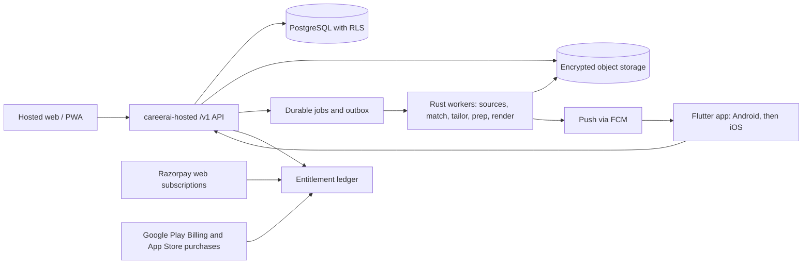
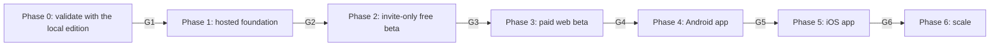

# CareerAI mobile app and commercial strategy

Decision date: 2026-09-25. Evidence snapshot: branch `dev-main`, commit `720e0d0`.
Status: proposed. A phase starts only after its entry gate in §9 is signed off by the named owner.

Related documents: [PRODUCT_REVIEW_AND_PLAN.md](PRODUCT_REVIEW_AND_PLAN.md), [HOSTED_PRODUCT_DESIGN.md](HOSTED_PRODUCT_DESIGN.md), [HOSTED_BETA_SCOPE.md](HOSTED_BETA_SCOPE.md), [HOSTED_UNVERIFIED_DEPENDENCIES.md](HOSTED_UNVERIFIED_DEPENDENCIES.md).

All prices, quotas, budgets, durations, and thresholds below are hypotheses to test. They are not forecasts, vendor quotes, or tax, legal, or accounting advice.

## 1. Decision

**Build neither the Android/iOS apps first nor rely only on the current local method for revenue.**

1. Keep the local edition (CLI, daemon, local dashboard, MCP plugin) as the free, self-managed product and the technical-trust channel.
2. Sell a hosted, mobile-responsive web product first. Start sales and marketing now with the local edition and synthetic demos; do not wait for an app.
3. Build one Flutter codebase for Android, then iOS, as a companion client of the same hosted API, only after gate G4 (paid demand and mobile usage) passes.

### Why not build the apps first

- **There is no backend a phone can safely use.** The hosted service keeps every store in process memory and creates a new user and tenant on each login (§2). An app would have nothing durable, isolated, or billable to call.
- **The valuable work is server- and desk-bound.** Rendering calls `pandoc`, state lives in local SQLite and files, and discovery runs as a daemon. Profile confirmation and resume-diff review suit larger screens; phones suit alerts, triage, preparation, and tracking.
- **Stores add cost and policy work before the first sale.** Apple charges US$99 per membership year; Google charges US$25 once. Subscription commissions are 15% in the expected case (30% stress case), digital upgrades require in-app purchase, apps with account creation require in-app account deletion, and new personal Google Play accounts need a 12-tester, 14-day closed test before production access.
- **Downloads do not prove willingness to pay.** Job search is episodic, so paid retention must be measured before multiplying client surfaces.
- **Local users already get phone alerts.** The notifier supports Slack, Telegram, email, and ntfy (`crates/careerai-notify/src/dispatcher.rs:63-86`).

### Why not stay only with the current method

- It is a single-user local install (Rust binaries, `pandoc`, and the user's own LLM access) with no accounts, payments, or hosted delivery, so revenue would be limited to donations or services.
- Setup friction limits reach to people comfortable installing developer tools.
- The root README advertises auto-apply (`README.md:3`) and warns that LinkedIn and Indeed auto-apply violate their terms (`README.md:353-357`). A paid offer must stay review-only; the hosted beta already excludes live submission and browser automation.

### Options considered

| Option | What it proves | Work before the first paid test | Main blocker | Verdict |
|---|---|---|---|---|
| A. Local only (current) | Technical users value the workflow | None | No accounts or billing; setup friction | Keep as the free edition, not the revenue engine |
| B. Native apps first | Store discovery and downloads | Hosted backend, Flutter client, in-app purchase, two store reviews | No backend; store fees and policy; unproven demand | Reject for now |
| C. Hosted web first, then Flutter companion | Paid demand, then mobile demand | Hosted backend and responsive web | Hosted foundation work (§9 Phase 1) | **Selected** |
| D. Wrap the dashboard in a WebView | Store presence only | Wrapper | Apple guideline 4.2 rejects repackaged websites; the dashboard is loopback and single-user | Reject |

## 2. Current state (evidence snapshot)

| Area | Evidence | Consequence |
|---|---|---|
| Local access | `crates/careerai-dashboard/src/lib.rs:63-80,102-106` binds to loopback by default, requires `CAREERAI_DASHBOARD_ALLOW_NON_LOOPBACK=1` for other addresses, and accepts an optional static `CAREERAI_DASHBOARD_TOKEN` | A single-user local tool, not a remote login system |
| Local API | `crates/careerai-dashboard/src/routes.rs:96` exposes `/api/v1/cli/run`; `crates/careerai-dashboard/src/profile_handler/pipeline.rs:59,141` runs the CLI synchronously for up to 600 seconds with `CAREERAI_LLM_LIVE=1` | Useful internally; not a public, versioned, or asynchronous API |
| Live submission | `crates/careerai-dashboard/templates/index.tera:3586,3620,3672` send `auto_submit`; `crates/careerai-dashboard/src/profile_handler/pipeline_args.rs:43-45,103-105` forward `--auto-submit` | Must not reach hosted or mobile surfaces before the controlled side-effects milestone (M6, `docs/HOSTED_BETA_SCOPE.md:76`) |
| Mobile web | `crates/careerai-dashboard/templates/index.tera:5-10` adds viewport, Apple web-app, and manifest metadata; `crates/careerai-dashboard/static/sw.js:1-3,19` caches only CSS, JS, and the manifest | Responsive and installable-looking; no offline data; not an app |
| Hosted runtime | `crates/careerai-hosted/src/main.rs:20-37` defaults to `0.0.0.0:3000` and falls back to an all-zero key without `MASTER_KEY`; `crates/careerai-hosted/src/api/state.rs:3,29-51` keeps stores in memory; `crates/careerai-hosted/src/api/auth_handlers.rs:100-138` creates a new user and tenant per login; `crates/careerai-hosted/src/api/auth_handlers.rs:170-174` retains raw login tokens in `dev_tokens`; `crates/careerai-hosted/src/api/billing_handlers.rs:41-44` returns a placeholder checkout URL; `crates/careerai-hosted/src/workers/mod.rs:70,110-113` dispatches synchronously and refuses discovery and rendering; `crates/careerai-hosted/src/api/resource_handlers.rs:41,88,167` discard admission reservations | A prototype for synthetic data only; no real candidate data or payments |
| Profile import | `crates/careerai-hosted/src/api/resource_handlers.rs:27-29` accepts server file paths, which `crates/careerai-hosted/src/workers/adapters.rs:18-22,36-42` read from the server filesystem | Must become a byte upload before any remote client uses it |
| Reusable commercial core | `crates/careerai-hosted/src/entitlement/admission.rs:43,105,116,143,172` (`EntitlementDecision`, `finalize`, `release`, `UsageReservation`, `admit`); `crates/careerai-hosted/src/ops/billing_adapter.rs:53` (`BillingAdapter`); `crates/careerai-hosted/src/entitlement/billing.rs:151` (`plan_change_effect`) | The convergence point for web and store purchases once durable and transactional |
| External prerequisites | `docs/HOSTED_UNVERIFIED_DEPENDENCIES.md:13-31,46`: all 17 items Pending; items 1, 2, 3, 9, and 10 are required before paid beta | No charging until signed off |
| Native clients | No Swift, Kotlin, Dart, Gradle, Xcode, Flutter, or React Native project files exist | Mobile starts from zero client code |
| Documentation drift | `crates/careerai-dashboard/README.md:3,41,45-50` still describes a read-only, no-API, no-auth dashboard | Do not reuse README claims in sales, marketing, or store copy |

### Market and platform facts

| Fact | Value | Source | Use |
|---|---|---|---|
| India mobile OS share, Aug 2026 (page views) | Android 92.79%, iOS 7.15% | StatCounter | Android before iOS |
| India device share, Aug 2026 (page views) | Mobile 64.45%, desktop 34.97%, tablet 0.58% | StatCounter | Hosted web must work on phones from day one |
| Apple Developer Program | US$99 per membership year; 30% commission, 15% under the Small Business Program or for qualifying subscriptions | Apple | Store cost model |
| Google Play | US$25 one-time; 15% service fee on auto-renewing subscriptions under the schedule that currently covers India; updated fees are rolling out by region | Google | Store cost model |
| Razorpay (India) | 2% domestic platform fee plus 18% GST on the fee; card subscriptions add 0.9% plus platform fees; UPI and NACH recurring pricing on request | Razorpay | Web payment cost model |
| Stripe (India) | New accounts are invite-only | Stripe | Not an assumed launch dependency |
| Competitor list prices | Huntr Pro US$40/month or US$90/quarter; Teal+ US$13/week | Huntr, Teal | Positioning reference only |

Page-view shares describe general web traffic, not job-seeker behaviour; measure CareerAI's own device mix (§10).

## 3. Customer and positioning

- **Initial customer:** English-speaking AI/ML application engineers with 1–7 years of experience seeking India-based or India-eligible remote roles. This narrows the hosted-beta niche (`docs/HOSTED_BETA_SCOPE.md:8-10`) to one segment. Embedded and robotics engineers are the fallback segment if G1 fails.
- **Jobs to be done:** find a few credible roles; understand fit and gaps; produce honest tailored applications quickly; keep follow-ups and interviews on track.
- **Positioning:** "For AI/ML engineers in India, CareerAI finds relevant roles, explains the fit, and prepares honest applications from your real experience, so you apply to fewer, better roles and never lose track of the next step. It never invents experience and never sends anything for you."
- **Differentiators to prove in demos:** explainable fit and gaps; constrained tailoring that only reorders or rewrites existing profile bullets; review before anything leaves the user's hands; export and deletion; a local edition for users who want everything on their own machine.

### Claims we never make

- Guaranteed interviews, offers, or salary outcomes (`docs/HOSTED_PRODUCT_DESIGN.md:259`).
- Auto-apply, mass-apply, or LinkedIn, Indeed, or Naukri automation.
- "Unlimited AI".
- Vague privacy promises. State exactly what is stored, which model provider receives which data, and how deletion works.
- Fake, incentivised, or unrepresentative reviews or testimonials. Testimonials require written consent.

## 4. Product surfaces and plans

| Surface | Audience | Scope | Price | Starts |
|---|---|---|---|---|
| Local edition | Technical users who self-host | Full local pipeline with the user's own LLM access; `MIT OR Apache-2.0` (`Cargo.toml:27`) | Free | Available now |
| Hosted web (responsive, installable PWA) | Initial customer | Hosted beta inclusions 1–7 (`docs/HOSTED_BETA_SCOPE.md:12-22`) | Free and Pro | Built in Phase 1; charges from Phase 3 |
| Android app (Flutter) | Hosted users | Companion scope in §5.5 | Same plans; Google Play Billing | Phase 4 after G4 |
| iOS app (Flutter) | Hosted users | Same code and scope | Same plans; App Store in-app purchase | Phase 5 after G5 |

### Plans

- **Free:** profile confirmation; unlimited manual job and outcome tracking; read, export, and delete own data; 2 lifetime application packs and 1 lifetime preparation program. Email verification is required before any metered work; no card is required.
- **Pro, ₹999/month with tax-inclusive display (India):** permitted scheduled discovery, explainable shortlist, reminders, 20 application packs and 4 preparation programs per billing period. ₹999 is an India regional price version; the hosted design's US$15–25 Pro range (`docs/HOSTED_PRODUCT_DESIGN.md:255`) remains the reference for other regions.
- **Units:** one application pack is one job-specific resume and cover-letter pair with preview and PDF/DOCX output. One preparation program is one role or company dossier with evidence-linked questions and candidate stories. Downloading existing output and infrastructure retries consume nothing; an explicit regeneration consumes one unit. Unused units do not roll over, and there is no hidden overage.
- **One subscription, every device:** Pro bought on the web or in a store works on the web, Android, and iOS. The user manages it in the channel where it was bought.
- **Cancellation and refunds:** cancel any time; access continues to the end of the period; read, export, and delete remain available afterwards. Web purchases get a full refund on request within 7 days of the first payment if fewer than 3 application packs were used; otherwise refunds cover duplicate charges, failed delivery, or legal requirements. Store purchases follow Apple's and Google's refund processes. Publish retention periods; never promise indefinite storage.
- **Price step:** if at least 6 of the first 10 paid offers convert, offer ₹1,499 to the next 10 activated users. Existing payers keep their price for 12 months.
- **Later tests, excluded from revenue assumptions:** a non-renewing 30-day pass at ₹999 only if cancellation interviews show an auto-renewal objection (never counted as recurring revenue); annual plans after two cohorts complete; coach or cohort licensing only after delegation and confidentiality design; Concierge stays off.
- **Revenue we refuse:** advertising based on candidate data, selling candidate data, paid ranking, undisclosed referral fees, and outcome- or salary-contingent fees.

## 5. Mobile architecture using this repository

### 5.1 Principles

- Every pipeline step (discovery, matching, tailoring, preparation, rendering) runs on the server in Rust. The phone is a client.
- Web and mobile use one versioned JSON API (`/v1`). After the first page render, the hosted web performs every data fetch and mutation through that API, following the local dashboard's fetch-based pattern, so the API is production-proven before mobile work starts.
- The Flutter client lives in this repository at `apps/mobile/` (package `careerai_mobile`). The Rust workspace in `Cargo.toml` is unchanged, and `apps/` is not a Cargo member.
- Nothing is ported onto the phone: `pandoc` and PDF rendering, SQLite, keyring credentials, browser automation, and schedulers stay on servers (§2).
- The hosted PWA follows the local service-worker policy: cache static assets only, never candidate data (`crates/careerai-dashboard/static/sw.js:1-3,19`).

### 5.2 Target architecture

The local edition keeps its own SQLite database, files, and daemon, and never shares a runtime with the hosted service.

### 5.3 Reuse map

This extends the reuse table in `docs/HOSTED_PRODUCT_DESIGN.md:81-94`.

| Crate | Role once mobile ships | Required change |
|---|---|---|
| `careerai-hosted` | API, identity, tenancy, entitlements, billing adapters | Replace in-memory state with the durable design in `docs/HOSTED_PRODUCT_DESIGN.md` before any customer data |
| `careerai-pipeline` | Stage policies inside workers | Replace local file and process I/O with job ports |
| `careerai-profile` | Resume parsing in isolated workers | Parse uploaded bytes from quarantine, never server paths |
| `careerai-sources` | Discovery workers | Only sources with written paid-use permission (dependency 3) |
| `careerai-match` | Scoring and explanations in workers | Unchanged pure logic |
| `careerai-tailor` | Constrained tailoring in workers | Unchanged guardrails |
| `careerai-prep` | Preparation programs in workers | Persist programs per tenant |
| `careerai-render` | Worker-only rendering | Sandbox `pandoc`; write artifacts to object storage |
| `careerai-llm` | Model access and cost records | Finalise per-tenant cost from `CostRecord` and `estimate_cost` (`crates/careerai-llm/src/cost.rs:21,54`) |
| `careerai-notify` | Server-side notifications | Add a push channel beside Slack, Telegram, email, and ntfy |
| `careerai-db`, `careerai-cli`, `careerai-dashboard`, `careerai-mcp`, `careerai-scheduler`, `careerai-submit` | Local edition only | Never exposed to hosted or mobile clients |

### 5.4 API prerequisites (part of G4)

1. An OpenAPI 3.1 contract at `crates/careerai-hosted/openapi/v1.yaml`; server contract tests validate every response against it; breaking changes require `/v2`. The Dart client is hand-written and tested against the same JSON fixtures as the server contract tests.
2. `application/problem+json` errors with stable `type` URIs.
3. Cursor pagination and server-side filters on every list endpoint; clients never download the whole corpus.
4. An `Idempotency-Key` header on every POST that creates work or consumes usage.
5. Long work returns `202 Accepted` with a job resource (`queued`, `running`, `succeeded`, `failed`, `cancelled`) that supports cancellation.
6. Resume upload as bytes: PDF or DOCX, at most 10 MiB, quarantined and scanned before parsing. The path-based import is removed.
7. Artifacts addressed by opaque IDs with short-lived signed download URLs; deleted artifacts cannot be downloaded.
8. Endpoints for plan, usage, and subscription status; outcomes; reminders; push-device registration; export and deletion status.
9. Clients send `CareerAI-Client-Version`; unsupported versions receive `426 Upgrade Required` with an upgrade message.

### 5.5 Mobile v1 scope

In scope:

1. Sign-in, sign-out, in-app account deletion, and export requests.
2. Onboarding: upload a resume from Files, choose a target role and location, and confirm parsed profile sections. Detailed profile and settings editing stays on the web.
3. Matches: fit explanation, gaps, freshness, and eligibility uncertainty; mark useful or irrelevant; shortlist; open the original posting in the system browser.
4. Application packs: request generation (showing remaining quota), preview resume changes and the cover letter, and share PDF/DOCX through the system share sheet.
5. Preparation programs: read them and check off practice items.
6. Tracking: record outcomes; follow-up reminders with snooze and done. Users submit applications themselves.
7. Notifications: new high-fit matches, due follow-ups, and preparation due dates.
8. Plan and usage; Pro purchase and restore through the store.

Excluded from v1: live submission, browser automation, mailbox sync, AI chat, offline generation, and coach access.

### 5.6 Identity, sessions, and on-device data

- Sign-in uses an emailed link opened through Android App Links and iOS Universal Links, plus a 6-digit code in the same email for cross-device sign-in (10-minute expiry, 5 attempts). The hosted TOTP step must work in the app.
- Keep the single-use and anti-forwarding properties of `MagicLinkToken::verify` (`crates/careerai-hosted/src/auth/magic_link.rs:110-130`), but for app sign-ins bind the login transaction to a random verifier generated and held by the app that started it (PKCE-style) instead of an exact user-agent and IP match. Phone IP addresses change between the request and the tap.
- The web uses Secure, HttpOnly, SameSite cookies with CSRF protection. The apps use 15-minute access tokens and refresh tokens that rotate on every use, expire after 30 days, and revoke the whole session family when reuse is detected. Both are backed by the same server-side session records. Tokens are stored only in the iOS Keychain or Android Keystore-backed storage.
- Export and account deletion require re-authentication within the last 10 minutes.
- The device keeps only a read cache of recently viewed items inside the app sandbox; sign-out and account deletion clear it. No resume file is stored outside a user-initiated share.

### 5.7 Notifications

- Firebase Cloud Messaging for Android and iOS (delivered to iOS through APNs), sent by a new server-side channel in `careerai-notify`. Use Cloud Messaging only; no Firebase Analytics.
- Lock-screen text is generic by default ("3 new matches are ready"); company and role names appear only after the user opts in.
- Every notification type is opt-in and individually switchable, and every send is recorded for audit.
- Add Firebase to the subprocessor inventory and privacy disclosures before the first push.

### 5.8 Purchases and entitlements

- Use the Flutter team's `in_app_purchase` plugin (flutter/packages) for Google Play Billing and StoreKit.
- Verify every purchase on the server: Google Play Developer API with Real-time developer notifications; App Store Server API with App Store Server Notifications V2. Only verified, active purchases change entitlements; pending purchases unlock nothing.
- Bind purchases to the signed-in account with Apple's `appAccountToken` and Google's obfuscated account ID. If the plugin does not expose either field, add a small platform channel for it.
- Normalise web and store events into one entitlement ledger by making `EntitlementDecision` and `UsageReservation` durable. Handle renewals, grace periods, account holds, refunds, revocations, and duplicate or out-of-order notifications idempotently.
- A user who already has Pro from another channel sees "Pro active (managed on the web / in Google Play / in the App Store)" and no purchase button.
- The apps contain no link or call to action for web purchase (Apple guidelines 3.1.1 and 3.1.3; Google Payments policy). Web-bought Pro works in the apps because Pro is also sold in-app (Apple guideline 3.1.3(b)).
- Store price: ₹999 where the store's INR price points allow; otherwise the nearest price point above it. Enrol in the App Store Small Business Program before the first sale.
- Google Play's alternative billing for India (service fee reduced by 4%) is a later optimisation after Play Billing works; it is not used at launch.

### 5.9 Build, test, and release

- Tooling: the current Flutter stable release at Phase 4 start; minimum OS versions are that release's supported minimums.
- CI: a new `.github/workflows/mobile.yml` runs `flutter analyze`, `flutter test`, and an Android release build on Linux, and iOS builds on a macOS runner. Xcode requires macOS; the Linux build fleet cannot produce signed iOS builds.
- Signing: the Android upload key and Apple signing credentials live in `kepr` and CI secrets, never in the repository; keep an offline backup of the upload key.
- Tests: unit and widget tests; integration tests against a staging API seeded only with synthetic data; physical devices (at least three Android phones, one with 4 GB RAM or less, and two iPhones); TalkBack and VoiceOver; large text; a throttled 3G network profile.
- Android release: internal testing, then closed testing, then a staged production rollout at 10%, 50%, and 100%, advancing only while crash-free users stay at or above 99%. A personal developer account created after 2023-11-13 needs at least 12 testers opted in for 14 consecutive days before applying for production access; recruit them from pilot and paying users and never pay for reviews. Prefer an Organization developer account if a registered business exists.
- iOS release: TestFlight external testing, then App Review with a demo account seeded with synthetic data, then a phased release.
- Store listings: real screenshots of shortlist, review, preparation, and tracking with synthetic data; accurate privacy labels and Data safety answers; a public web account-deletion page; no third-party advertising or analytics SDKs; crash data only from Play Console and App Store Connect.
- The application ID is the reversed business domain, chosen before the first Play upload; it is permanent once published.

## 6. Sales plan

Founder-led, permission-based, and measured by payments, not stated intent.

1. **Prospect list (Phase 0):** 60 qualified prospects from existing relationships and permitted community replies. Record only contact permission, role, location, current workflow, source, next step, and objection. No resume content, scraped contacts, or automated outreach.
2. **Problem interviews (Phase 0):** 20 interviews about the last applications completed, editing time, missed follow-ups, tools already paid for, privacy concerns, and which tasks happen on a phone. Ask for examples before demonstrating anything.
3. **Pilot (Phase 0):** 10–15 candidates install the local edition with their own LLM access (README install paths), dry-run only, with no LinkedIn automation. The founder never handles their data; help happens over screen share with consent. Check in on day 3 (friction), day 7 (completed applications), and day 14 (would they pay ₹999/month for the hosted version), and record waitlist consent at that price.
4. **Demo:** a synthetic candidate shown end to end: shortlist, fit explanation, constrained diff, preview, manual outcome. Never use a real person's CV.
5. **Invite beta (Phase 2):** invite waitlisted, activated users and offer a short assisted first session. Success is a confirmed profile and one reviewed match.
6. **Conversion (Phase 3):** offer Pro at ₹999 to the first 10 activated users. Five actual, non-refunded payments are the first willingness-to-pay signal. With fewer than five, pause native work, interview decliners, change one variable (offer, segment, or onboarding), and run another cohort of 10. Never silently cut prices or redefine activation.
7. **Follow-up discipline:** at most two permission-based follow-ups per prospect, then stop. Record "found a job" cancellations separately from product failures.
8. **Partners:** five community or coaching operators and two approved workshops. Partners distribute invitations only; each candidate keeps a private workspace. No organisation seats or coach access before delegation design.

Outreach message: "I'm testing a job-search workspace for AI/ML engineers. It explains fit and prepares drafts from your existing experience; it never sends applications for you. Would you be open to a 20-minute conversation about how you search today?"

| Objection | Response |
|---|---|
| "I can use ChatGPT." | CareerAI keeps listings, profile evidence, drafts, and follow-ups together and refuses claims your profile doesn't support; show the diff guardrail in the demo. |
| "Is my data safe?" | Show what is stored, which model provider receives what, and how export and deletion work; the local edition keeps everything on your machine. |
| "₹999 is too much." | Compare it with the editing time measured in the pilot; it is month-to-month with a first-payment refund window. |
| "Will it apply for me?" | No. It is review-only by design, for quality and platform terms. |
| "I'm not searching now." | Tracking stays free; ask permission to check in later. |

## 7. Marketing plan

| Channel | Execution | Measurement and stop rule |
|---|---|---|
| Niche communities | With moderator permission, one useful walkthrough per week for four weeks and two live synthetic-data demos | Qualified visits, confirmed profiles, reviewed matches, and payments per community; stop after four posts with no activated users |
| Founder content | Two substantive posts per week for four weeks: explaining a match, fixing an unsupported claim, preparing for a technical interview, organising follow-ups | Tagged links and opt-in interviews; impressions and likes are not success |
| Search content | Four original pages: AI/ML resume tailoring, job tracking, evidence-based interview preparation, and a permissioned synthetic case study | Qualified visits and activation after eight weeks; no mass-generated pages, copied listings, or unsupported competitor claims |
| Community and coaching partners | Five conversations, two workshops, a privacy explainer, the demo, and an invitation link | Continue only if one partner yields three activated users; never exchange candidate data |
| Referrals | Ask satisfied users to share an invitation; no reward at first | Referred activation and payment; never buy reviews or gate features on ratings |
| Paid acquisition | Only after 20 paying customers, observed renewals, and positive contribution: one ₹5,000 capped test with one message and one landing page | Stop at the cap; scale only if CAC meets the §8 limits; small tests are not statistically conclusive |
| App stores (after G4) | Real-device screenshots, truthful keywords, privacy and billing disclosures | Store visit, install, activation, payment, and renewal; never downloads alone |

- **Cash cap until G4:** ₹15,000, split into ₹3,000 for landing and demo assets, ₹4,000 for workshops and community distribution, ₹5,000 reserved for the gated paid test, and ₹3,000 contingency. An unused reserve stays unspent. Engineering, hosting, legal review, and founder time are budgeted separately.
- **Attribution:** UTM-tagged links per channel and partner; first-party events only (§10).
- **Claims:** apply "Claims we never make" (§3) everywhere, including store listings and notifications.

## 8. Revenue model and unit economics

### Payment channels

- **Web (India):** Razorpay subscriptions after merchant approval and confirmation of recurring-payment terms, refund terms, and tax treatment. Stripe is invite-only for new Indian accounts and is not assumed. If no provider is approved, stay free and invite-only; never unlock Pro from a client-side flag.
- **Android and iOS:** store billing as specified in §5.8.

### Model

Hypotheses: gross price G = ₹999; illustrative inclusive tax t = 18%; tax-exclusive revenue R = G / (1 + t) = ₹846.61; web payment allowance 4% of G (conservative; Razorpay's listed card-subscription fees are lower); store commission 15% of R (30% stress case); refund reserve 3% of R; AI ₹100, rendering, storage, and compute ₹30, and support ₹50 (five minutes at ₹600/hour) per active payer-month.

Contribution C = R − payment or store fee − refund reserve − AI − delivery − support. It excludes acquisition, fixed operations, development, and income tax, so it is not profit.

| Channel | Revenue (ex-tax) | Fee | Refund reserve | Other variable | Contribution per payer | Margin |
|---|---:|---:|---:|---:|---:|---:|
| Web | ₹846.61 | ₹39.96 | ₹25.40 | ₹180.00 | ₹601.25 | 71.02% |
| Store at 15% | ₹846.61 | ₹126.99 | ₹25.40 | ₹180.00 | ₹514.22 | 60.74% |
| Store at 30% (stress) | ₹846.61 | ₹253.98 | ₹25.40 | ₹180.00 | ₹387.23 | 45.74% |

| Active web payers | Gross billings | Revenue (ex-tax) | Contribution | After ₹30,000 fixed cash costs |
|---:|---:|---:|---:|---:|
| 20 | ₹19,980 | ₹16,932.20 | ₹12,025.04 | −₹17,974.96 |
| 100 | ₹99,900 | ₹84,661.02 | ₹60,125.19 | ₹30,125.19 |
| 500 | ₹499,500 | ₹423,305.08 | ₹300,625.93 | ₹270,625.93 |

- Break-even payers = ceil(fixed costs / C). At ₹30,000 per month: 50 web or 59 store payers. At a fully loaded ₹150,000 per month (paid labour and operations): 250 web or 292 store payers. A 70% web / 30% store mix yields ₹575.14 per payer and needs 53 or 261.
- The dashboard's per-job token figures (about 1,250 input and 420 output tokens; `crates/careerai-dashboard/templates/index.tera:1046-1061`) are unmeasured estimates. Replace the ₹100 AI assumption with metered cost during the invite beta.
- Free users' AI cost is capped by lifetime quotas; report it as cost per activated free user.
- Churn: at 20% monthly churn, 100 payers need 20 new payers every month just to stay level. Do not estimate lifetime value as ARPU divided by churn from small cohorts.
- CAC limits: ₹600 on the web and ₹500 through stores, judged on observed average paid months (assume 3 until two cohorts complete: ₹1,803.76 web and ₹1,542.66 store contribution). Expand a channel only if contribution-to-CAC is at least 3 and cash payback is at most 3 paid months. Report cash CAC and fully loaded CAC (including referral discounts and acquisition labour).
- Margin gates: measured web margin of at least 70% and store margin of at least 60%, including support and heavy-quota users. These are internal targets, not benchmarks. If usage breaks the model, keep current commitments, pause expansion, and publish a new price or quota version for new buyers only. If stores charge 30% and the store margin gate fails, keep mobile users on the responsive web.

### Revenue sequencing

Phases 0–2 generate no planned revenue. Revenue starts in Phase 3 with web Pro. The apps add store-billed Pro in Phases 4–5. Sponsorships or donations for the local edition are not planned revenue.

## 9. Roadmap and gates

Durations assume one full-time engineer and are recalibrated after the first four weeks of each phase. One person may hold several owner roles, but G2 and G3 require documented external security and legal review.

| Phase | Work | Exit gate | Owner | If the gate fails |
|---|---|---|---|---|
| 0. Validate (weeks 0–4) | §6 steps 1–4; fix onboarding defects that block pilot users | **G1:** ≥20 interviews; ≥10 pilot users onboarded; ≥60% onboarding completion; ≥40% week-two return; ≥5 waitlist sign-ups at ₹999/month | Product/Engineering lead | Iterate for 4 more weeks; then test the embedded/robotics segment; after a second failure keep the local edition open source and stop commercial work |
| 1. Hosted foundation (12–16 weeks) | Hosted design PRs 1–7 and the beta subset of PR 12 (`docs/HOSTED_PRODUCT_DESIGN.md:383,391-394`): PostgreSQL with RLS, persistent identity, durable jobs, object storage, transactional entitlements with automatic Free plans, complete export and deletion, observability; responsive web and PWA on the `/v1` API | **G2:** hosted beta inclusions 1–7 work on synthetic data; zero cross-tenant test failures; restore, export, and deletion drills pass; security review and privacy notice done; dependencies 3, 9, and 10 signed off | Product/Engineering lead; Security; Legal/Privacy | Stay on synthetic data; no real candidate data enters the hosted service |
| 2. Invite-only free beta (≥30 days, ≥20 users) | Invite the waitlist; §6 step 5 | **G3:** every exit criterion in `docs/HOSTED_BETA_SCOPE.md:37-57`; dependencies 1 and 2 signed off; payment provider approved; terms, refund policy, and pricing page published | Product/Engineering lead; Operations; Legal/Privacy | Remain invite-only; roll back failing feature flags |
| 3. Paid web beta (60–90 days) | §6 step 6; §7 channels; API v1 freeze | **G4:** ≥20 active paying subscribers; month-2 renewal ≥50% of first-month payers (found-a-job cancellations reported separately); measured web margin ≥70%; ≥35% of weekly active users use a phone weekly, or ≥30% of paying users (n ≥ 20) ask for an app; §5.4 complete | Product/Engineering lead; Finance | Stay web-only and keep improving conversion; no native work |
| 4. Android app (8–12 weeks plus the closed test) | §5.5–§5.9 | **G5:** 60 days after production, ≥30% of Pro subscribers use the Android app weekly; zero unresolved entitlement mismatches for 30 days; crash-free users ≥99%; iOS accounts for ≥15% of phone-using weekly active users (n ≥ 50) | Product/Engineering lead | Keep iPhone users on the responsive web |
| 5. iOS app (4–6 weeks) | Same Flutter code; Apple enrolment; TestFlight; App Review | **G6:** two consecutive monthly cohorts meet the §8 CAC and payback limits; both margin gates hold; support time stays within ₹50 per payer-month | Product/Engineering lead; Finance | Hold paid acquisition; continue organic channels |
| 6. Scale | Expand paid acquisition, test annual plans, add a second niche; new regions only after regional legal, tax, and pricing review | Reviewed quarterly | Product/Engineering lead | Return to the last passing phase's channels |

## 10. Metrics

| Metric | Definition |
|---|---|
| Activated user | Confirmed profile and at least one reviewed match within 7 days of sign-up |
| Weekly active user | At least one authenticated session with a product event in the trailing 7 days |
| Phone usage share | Weekly active users with at least one phone session (coarse device class derived on the server; raw user agents are not stored), divided by weekly active users |
| Paid conversion | Activated users who pay within 30 days of an offer, divided by activated users offered Pro |
| Month-2 renewal | First-month payers who renew, divided by first-month payers |
| MRR | Active subscriptions × monthly price, tax-exclusive, net of refunds, by channel |
| Contribution margin | The §8 formula using actual invoices and metered usage |
| CAC | Channel spend divided by new payers from that channel (cash and fully loaded) |
| Crash-free users | The store console metric for each release |
| Entitlement mismatch | A verified web or store subscription state that differs from the ledger for more than one hour |

- North star (`docs/PRODUCT_REVIEW_AND_PLAN.md:56`): qualified employer conversations per weekly active candidate.
- Events reuse the hosted design's envelope and names (`docs/HOSTED_PRODUCT_DESIGN.md:245`) and add `push_opt_in_changed`, `push_opened`, `purchase_verified`, and `purchase_revoked`. Telemetry is opt-in; rates need n ≥ 20 within a 30-day window.
- Guardrails: at least 80% of generated claims have evidence or an unresolved label; zero live external writes; zero cross-tenant incidents; first support response within one business day.

## 11. Trust and compliance checklists

### Before real candidate data enters the hosted service (G2)

- Dependencies 3 (source permissions), 9 (model retention and DPA), and 10 (KMS and object storage) signed off.
- Security review, privacy notice, subprocessor inventory, incident runbook, and deletion and export drill (`docs/HOSTED_BETA_SCOPE.md:59-66`).
- Indian legal review of data-protection obligations, including the Digital Personal Data Protection Act, 2023.

### Before charging (G3)

- Dependencies 1 (merchant of record) and 2 (billing behaviour) signed off; payment provider approved.
- Terms of service, refund policy, and a tax-inclusive pricing page published; an accountant confirms GST registration and invoicing.
- Support contact and grievance channel published.

### Before each store submission (Phases 4–5)

- In-app account deletion and a public web deletion page; Google's Data safety answers and Apple's privacy labels match actual data flows, including Firebase.
- Purchases available and working in review builds; a demo account with synthetic data; no external purchase links.
- Current Play Console policy requirements (including target API level and closed testing) met; App Store Small Business Program enrolment complete.
- Notification copy, screenshots, and descriptions follow the §3 claims rules.

## 12. Sources (accessed 2026-09-25)

Recheck store fees, payment pricing, and platform policies before Phase 3 and before each store submission.

- Apple Developer Program membership details: https://developer.apple.com/programs/whats-included/
- Apple App Store Small Business Program: https://developer.apple.com/app-store/small-business-program/
- Apple App Review Guidelines (2.1, 3.1, 4.2, 5.1.1(v)): https://developer.apple.com/app-store/review/guidelines/
- Google Play Console registration: https://support.google.com/googleplay/android-developer/answer/6112435
- Google Play service fees: https://support.google.com/googleplay/android-developer/answer/112622
- Google Play Payments policy: https://support.google.com/googleplay/android-developer/answer/9858738
- Google Play testing requirements for new personal accounts: https://support.google.com/googleplay/android-developer/answer/14151465
- Google Play account deletion requirements: https://support.google.com/googleplay/android-developer/answer/13327111
- Flutter iOS setup: https://docs.flutter.dev/platform-integration/ios/setup
- Flutter `in_app_purchase` plugin: https://pub.dev/packages/in_app_purchase
- Razorpay pricing (India): https://razorpay.com/pricing/
- Stripe accounts in India: https://support.stripe.com/questions/stripe-accounts-are-invite-only-in-india
- StatCounter India mobile OS share: https://gs.statcounter.com/os-market-share/mobile/india
- StatCounter India device share: https://gs.statcounter.com/platform-market-share/desktop-mobile-tablet/india
- Huntr pricing: https://huntr.co/pricing
- Teal pricing: https://www.tealhq.com/pricing
